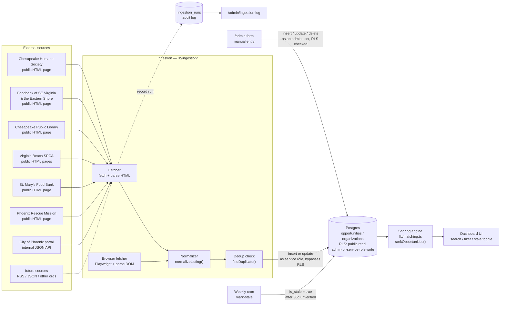

# Architecture

This document describes the data pipeline that turns a volunteer
opportunity — however it originates — into a ranked recommendation on a
student's dashboard. It's written for someone extending this codebase,
not as a feature tour; see the [README](./README.md) for that. For the
algorithmic complexity of the scoring, dedup, and normalization stages
described below, see [COMPLEXITY.md](./COMPLEXITY.md).

## System overview

Opportunities enter the system through two independent paths that
converge on a single Postgres table: a human typing into `/admin`, and
an automated fetcher scraping a real organization's public listings
page. Both paths write the same shape of row, so nothing downstream —
the scoring engine, the dashboard, the organization pages — needs to
know or care where a given opportunity came from. The `source`,
`external_id`, and `last_verified_at` columns exist purely for the
ingestion layer's own bookkeeping; they're inert for manually-entered
rows and invisible to the UI.

A weekly job separately sweeps the table for listings that haven't been
re-verified recently and flags them stale, which the dashboard hides by
default. That's the other half of the "automated ingestion" story:
getting data in is only useful if the app also knows when that data has
gone dark.



---

## 1. Source

Eleven automated sources feed the pipeline today, each chosen to be
structurally distinct from the others rather than variations on the
same theme. The first four are Virginia Beach/Chesapeake-area; the
last seven (added once the app's actual user base turned out to be
Phoenix-based, not Virginia-based) are Phoenix/statewide Arizona, and
two of those are structurally different in kind, not just markup — see
below.

- [Chesapeake Humane Society's public volunteer opportunities
  page](https://chesapeakehumane.org/volunteer-opportunities/) —
  `<p><strong>Role</strong><br/>description</p>` blocks, one per named
  role (cat care, foster care, adoption events, ...), on WordPress.
- [Foodbank of Southeastern Virginia and the Eastern Shore's "Ways to
  Volunteer" page](https://www.foodbankonline.org/get-involved/volunteer/)
  — a `<ul><li><strong>Track: </strong>description</li></ul>` list, one
  item per volunteer track (traditional shifts, ongoing involvement,
  leadership) rather than per named role, on a different WordPress
  theme entirely.
- [Chesapeake Public Library's volunteer
  page](https://www.chesapeakelibrary.org/volunteer) —
  `<h2 class="subhead1">Role</h2><p>description</p>` pairs, on
  CivicPlus, a government-sector CMS with nothing in common with either
  WordPress site's markup.
- [Virginia Beach SPCA's volunteer
  pages](https://vbspca.com/adult-volunteers/) — Divi-theme WordPress
  accordion modules (`<h5 class="et_pb_toggle_title">Heading</h5><div
  class="et_pb_toggle_content">...</div>`), and structurally different
  from the other three in a second way too: one opportunity **per
  page** (`/adult-volunteers/`, `/junior-volunteers/`) rather than
  several roles parsed out of a single page.
- [St. Mary's Food Bank's volunteer
  page](https://www.stmarysfoodbank.org/get-involved/volunteer/) —
  Elementor "call-to-action" widgets
  (`<h4 class="elementor-cta__title">...</h4><div
  class="elementor-cta__description">...</div>`) on WordPress; the
  org's actual shift-booking system
  (`stmarysfoodbank.volunteerhub.com`) is a separate JS SPA whose
  `robots.txt` disallows everything but a few account/event paths, so
  the fetcher deliberately only reads the informational activity cards
  on the org's own site, not that system.
- [Phoenix Rescue Mission's volunteer
  page](https://phoenixrescuemission.org/get-involved/volunteer/) —
  Kadence-block WordPress heading+paragraph pairs
  (`<h2 class="kt-adv-heading...">Title</h2><p
  class="...wp-block-paragraph">Description</p>`); same deliberate
  exclusion of its own JS-SPA booking system
  (`prm.volunteerhub.com`, `robots.txt`-disallowed) as St. Mary's.
- [City of Phoenix's volunteer
  portal](https://cop.samaritan.com/custom/501/opp_search) — an
  AngularJS SPA (a third-party "Samaritan" platform the city contracts
  for volunteer management), originally fetched via a real headless
  browser (Playwright) since the raw HTML response has no listing data
  in it, `ng-if`/`ng-bind` directives only. Rewritten to call the
  portal's own internal JSON API directly instead — see §2's "Why City
  of Phoenix stopped needing a browser" for the full story and the
  caveat that comes with it (this is an undocumented API, not a stable
  contract). Structurally different in a second way, unaffected by
  that rewrite: it's the only source spanning many different city
  departments (Parks & Rec, the Library Dept, S'edav Va'aki Museum, Sky
  Harbor Airport, ...) under one municipal portal, modeled as a single
  "City of Phoenix" organization with each opportunity's department
  folded into its description rather than split into per-department
  orgs — the data model here is one organization per source, not per
  real-world entity.
- [Special Olympics Arizona's volunteer
  page](https://specialolympicsarizona.org/volunteer/) — server-rendered
  HTML (unlike City of Phoenix, there's no client-side framework
  building the page), but requires a headless browser for a different
  reason: the site sits behind a WAF that returns a 403 block page to
  any non-browser HTTP client. Confirmed live before writing a single
  line of the parser — both `curl` and Node's own `fetch()` (with a
  full realistic browser header set, not just a spoofed User-Agent) get
  blocked identically; a real headless Chromium gets a clean 200 with
  the actual page. See §2's headless-browser section for why that
  distinction (SPA-with-no-server-HTML vs. static-HTML-behind-a-WAF)
  matters for how each fetcher is built. Also the first source modeled
  around *dated events* rather than standing roles: each of the ~35
  listings is a specific competition/fundraiser on a specific date in
  one of 8 regions (not the 6 originally assumed — the live filter list
  also includes Prescott & Chino Valley and Sedona & Cottonwood), with
  `application_deadline` set to the event's own date (after which
  signing up is moot) rather than left null.
- [Boys & Girls Club of Central Arizona's volunteer
  page](https://bgccaz.org/volunteer/) — plain server-rendered
  WordPress/Avada HTML, no bot-blocking of any kind: `robots.txt` only
  disallows `/wp-admin/`, and a plain `fetch()` with our bot User-Agent
  gets a clean 200. No login wall. The application itself is a static
  downloadable PDF form (emailed to a staff member or dropped off in
  person) — that PDF is linked as `application_url` on every row; this
  fetcher never parses or re-hosts it. Structurally the opposite problem
  from every other source: instead of discrete, markup-delimited
  listings to discover, the entire "types of volunteers" section is one
  flat, unstructured `<p>` with `<br/>` line breaks — no headings, no
  per-category markup, no per-category link. There's no structural
  signal distinguishing a top-level category ("Character and
  Leadership") from its sub-items ("Mentoring Teens", "Service
  Projects") — see §2 for how `lib/ingestion/sources/bgcCentralAZ.ts`
  handles a source with no structure to discover in the first place,
  rather than assuming a parser can always find one.
- [Firewheel STEM Institute's volunteer
  page](https://www.firewheel.org/volunteer) — added specifically to
  diversify STEM's single-location clustering: all 3 pre-existing
  STEM-tagged opportunities came from one source (City of Phoenix) and
  sat at the same downtown building, Burton Barr Central Library; a
  student more than ~15-20 miles away got zero STEM matches regardless
  of area density (see "Known trade-offs" below for the full research
  trail, including three candidates investigated and rejected first).
  Firewheel is a real, physically distinct location — Chandler, east
  valley. Wix-built, but the actual content is server-rendered in the
  initial HTML (confirmed by grepping the raw `fetch()` response before
  writing any parser) — no bot-blocking, no login wall. Structurally
  closer to BGC than to any Playwright source: one long Wix rich-text
  blob with no per-role markup, just three named sections (Event
  Volunteer / Program Mentor / Staff Support, each with a stable anchor
  id) and a flat `<ul><li>` bullet per role within each — hand-read into
  `lib/ingestion/sources/firewheelStem.ts`'s `ROLES`, same reasoning as
  BGC's hand-read category grouping. The one real wrinkle past BGC's
  precedent: age eligibility is stated once per *section*, not per
  role — 16+ for Event Volunteer, 18+ (plus background check) for
  Program Mentor and Staff Support — so `minimum_age` is set per role
  from that hand-read mapping rather than left to
  `extractMinimumAge()`'s single-value inference, which has no way to
  know which section a given role's description came from. All 10 roles
  share one application path (a single Google Form), linked as
  `application_url` on every row.
- [Arizona Science Center's volunteer opportunities
  page](https://www.azscience.org/support/volunteer-opportunities/) —
  unlike Firewheel, added for content variety at an *existing* location,
  not geographic diversification: this address (600 E. Washington St,
  Phoenix, AZ 85004) is the same downtown zip as the City of Phoenix
  STEM cluster (Burton Barr Central Library) — it was actually
  investigated and initially set aside *because* of that overlap while
  researching sources to fix STEM's geography problem, then picked back
  up separately once Firewheel had already solved that goal. Plain
  `fetch()`, no bot-blocking. Structurally closer to
  `chesapeakeHumane.ts` than to BGC or Firewheel: a genuinely
  discoverable Bootstrap accordion (`<div class="accordion-item">` per
  role, a `<button>` holding the title, an `accordion-body` holding a
  real intro paragraph plus a bulleted list of responsibilities) —
  `parseRoles()` in
  `lib/ingestion/sources/arizonaScienceCenter.ts` discovers all 6 roles
  from the markup itself, no hand-read hardcoded list needed. Confirmed
  live, each role's own public content (intro + 1-3 concrete
  responsibility bullets) is detailed enough to stand alone as a listing
  — worth checking explicitly, since applications route through a
  third-party Volgistics portal this fetcher deliberately doesn't
  scrape (same posture as St. Mary's/Phoenix Rescue Mission's own
  booking systems), so the page's own content had to be enough on its
  own. Age eligibility (15+) is one site-wide statement in the page's
  own intro paragraph, above the accordion — not per-role — so it's
  applied uniformly via an explicit override, not left to
  `extractMinimumAge()`'s per-role inference.

None of these were an accident of convenience: each is real, public
data meant to be read by prospective volunteers (and therefore fair
game to fetch), each requires no API key or partnership approval or
login, and each has markup (or, for City of Phoenix, a response shape)
stable enough that a regex/selector or field-mapping parser is a
reasonable tool rather than a hack — confirmed for each one
specifically (not assumed) by checking `robots.txt`, confirming a
fetch doesn't trip bot detection, and running the actual fetcher
against the live page before trusting it. Several candidate sites were
rejected at that checking stage rather than after writing a parser
against them: ForKids (a Norfolk nonprofit) sits behind a Cloudflare
bot challenge; the Chesapeake Bay Foundation's `robots.txt` explicitly
disallows every crawler not on a named allowlist (`User-agent: *` →
`Disallow: /`) — technically fetchable, explicitly not permitted; and
JustServe.org (a volunteer-opportunity aggregator, investigated as a
way to scale up listing volume significantly) has a real,
unauthenticated backing API and 100,000+ listings nationwide, but its
own Terms of Use explicitly prohibit "any robot, spider, or other
automatic device... for any purpose, including... monitoring or
copying any of the material," which settles that one regardless of the
technical feasibility. VolunteerMatch.org's data is now behind
Idealist's Open Network API — a real, legitimate path, but a
paid/negotiated B2B integration requiring a sales inquiry, not
something to pursue without the site owner's explicit go-ahead. On the
Phoenix side, the Phoenix Public Library's teen volunteer page
(`/teens/summer-teen-volunteers`) was investigated too: `robots.txt`
and rendering are both fine (SharePoint, server-rendered, no bot
block), but the page is seasonal — a Wayback Machine snapshot from
April 2026 shows real per-branch listings, while the live page today
(August) renders only nav chrome and an accessibility notice, the
actual content block emptied out until the library repopulates it for
next year's summer program. Deliberately not built against: parsing a
page's *current* emptiness would mean shipping a parser that's never
actually been proven against real content, and the fetcher would just
silently ingest zero rows all year until someone happened to notice.
Worth revisiting closer to next summer, once there's live content to
verify a parser against. All four gates — `robots.txt`, Terms of Use,
bot detection, and (for aggregators specifically) whether the data
being requested is even the operator's to license out — get checked
before a parser gets written, not after; for JS-rendered sources
specifically, "does it actually have current content to parse" is a
fifth check worth adding to that list.

The second through sixth sources specifically exist to pressure-test
the claim in §3 below — that `normalizeListing()` is genuinely
source-agnostic and not just code that happens to work on one page's
shape. All five proved it: zero changes to `normalize.ts` were needed
to onboard any of them (see
[`lib/ingestion/sources/foodbankSeva.ts`](./lib/ingestion/sources/foodbankSeva.ts),
[`lib/ingestion/sources/chesapeakeLibrary.ts`](./lib/ingestion/sources/chesapeakeLibrary.ts),
[`lib/ingestion/sources/vbspca.ts`](./lib/ingestion/sources/vbspca.ts),
[`lib/ingestion/sources/stmarysFoodBank.ts`](./lib/ingestion/sources/stmarysFoodBank.ts),
and
[`lib/ingestion/sources/phoenixRescueMission.ts`](./lib/ingestion/sources/phoenixRescueMission.ts)).
The seventh and eighth
([`lib/ingestion/sources/cityOfPhoenix.ts`](./lib/ingestion/sources/cityOfPhoenix.ts),
[`lib/ingestion/sources/specialOlympicsAZ.ts`](./lib/ingestion/sources/specialOlympicsAZ.ts))
pressure-test a different claim — that the fetch stage's output shape
(parsed title/description pairs headed for `normalizeListing()`) is
what matters, not *how* the fetch stage produces it. Both needed zero
changes to `normalize.ts` — confirmed for the eighth by running the
fetcher live against the real site and inspecting the resulting rows
directly, not assumed from the first one holding. (The seventh,
City of Phoenix, has since moved off headless-browser rendering
entirely — see §2's "The headless-browser fetcher, and the one that
stopped being one" — without the claim changing at all: `normalize.ts`
still doesn't know or care whether its input came from a rendered DOM
or a direct API call.)

The ninth
([`lib/ingestion/sources/bgcCentralAZ.ts`](./lib/ingestion/sources/bgcCentralAZ.ts))
pressure-tests the opposite end of the same claim: `normalizeListing()`
only ever has to consume whatever shape the fetch stage hands it, and
that still holds when the fetch stage's own job is harder than usual —
inventing structure (the category/sub-item grouping) that doesn't exist
in the source markup at all, rather than discovering structure that
does. Also needed zero changes to `normalize.ts`, but did need one
explicit field override past what the shared inference gets right:
verified live, `inferCategory()` scored "The Arts" a tie between "Arts
& Culture" and "STEM" (one keyword hit each — "art" vs. "technology"
from "Multimedia/technology"), and ties resolve to whichever category
sits earlier in `CATEGORY_OPTIONS`, which happens to be STEM — caught
by inspecting the actual ingested row, not assumed correct because the
fetch succeeded.

The manual `/admin` form is a twelfth source, and architecturally it's
treated as a peer, not a fallback — it writes to the identical
`opportunities` table, just authenticated as an admin user rather than
the service role the other nine use (see §5 for why those are two
different paths to the same table rather than one shared mechanism).

### Manual source integration: organizations without a scrapeable page

Ten more organizations were investigated for real STEM/teen-volunteer
content — museums, libraries, a STEM-education nonprofit, a mentoring
org, a state agency's community-science program, a STEM directory, and a
DOE-run student competition. None of them have a page shaped like any of
the twelve sources above: some are login-gated behind a third-party
portal (Arizona Museum of Natural History's BetterImpact system), some
are blocked site-wide (`azdeq.gov` 403s on every path tested, including
`robots.txt`), some have real content but no discrete per-role listing
(Museum of Northern Arizona's Junior Docents, a single contact-based
program), some are a links directory to *other* organizations' programs
rather than a source of their own (Arizona MESA), and one turned out not
to be a volunteer opportunity at all once actually read closely (the
Arizona Science Bowl — a student competition; competing isn't
volunteering, so it's never represented as one here even though the
"replacement domain" investigation below found a real, current host).

Rather than reject all ten for not fitting the scraper shape, or force
them through `normalizeListing()`'s regex-inference path they'd never
survive honestly, each was manually researched against a live,
accessible, first-party source (see `lib/manualRecords.ts` for the full
per-record citation trail — a search-cache snippet was never treated as
verification on its own; ADEQ's richer-sounding cached description was
explicitly discarded for exactly this reason once the live page turned
out to be blocked) and classified into one of two shapes:

- **A pure directory record** — an `organizations` row with no linked
  `opportunities` at all (Arizona Museum of Natural History, Arizona
  Community Science Alliance/ADEQ, Arizona MESA, Arizona Science Bowl).
  This is a real, load-bearing distinction, not a placeholder: a query
  that never puts a row in `opportunities` structurally cannot surface it
  in ranked matching, `/dashboard`, or the onboarding preview — there's
  nothing there to rank. It only ever appears on `/organizations` and its
  own `/organizations/[id]` detail page, which read `organizations`
  directly. "Don't count a directory record as an active opportunity"
  isn't enforced by a filter anywhere — it's true by construction.
- **A real `opportunities` row with `availability_status != 'open'`**
  (Museum of Northern Arizona, Pima County Public Library, SARSEF ×2,
  Junior Achievement, 4-H STEM Ambassador, Future Stars AZ) — genuine
  data, verified against a real source, but not a confirmed
  currently-accepting listing (seasonal/no published window, contingent
  on the org's own capacity, or a known event date already past). These
  rows *do* exist in `opportunities`, so `app/dashboard/page.tsx` and
  `app/onboarding/page.tsx`'s preview both explicitly filter to
  `.eq("availability_status", "open")` — without that filter these would
  silently mix into ranked results, which is exactly what a "manually
  curated, not confirmed open" record must never do. The filter lives at
  the query layer, not inside `lib/matching.ts` — `rankOpportunities()`'s
  own contract (every `Opportunity` passed in is real and active) is
  unchanged. `app/organizations/[id]/page.tsx`'s own query is
  deliberately *not* filtered — that's the one place a seasonal/
  unverified/closed row is supposed to be visible, with a status badge,
  since a curious student navigating there directly should see the real
  state, not have it hidden.

**Schema additions** (`supabase/add_manual_records_support.sql`):
`organizations.website_url`/`city`/`last_verified_at` (a directory record
needs somewhere to point to and a "when was this checked" timestamp
distinct from `opportunities.last_verified_at`, which an automated
fetcher sets on every re-scrape — this one is only ever set by a human);
`opportunities.availability_status` (`'open' | 'seasonal' | 'unverified' |
'closed'`, defaulting to `'open'` so every existing row — all twelve prior
sources — keeps its current behavior with zero migration needed); three
new `analytics_events.event_type` values
(`external_link_clicked`/`contact_interest_clicked`/
`program_availability_confirmed`).

**No dedicated schema for "external application" vs. "contact-only"** —
`lib/availabilityStatus.ts`'s `isContactOnlyLink()` reads the existing
`application_url` field instead: a `mailto:` link is contact-only (an
inbox to write to, not a form/portal to apply through), anything else is
a real application link. Every manual record's `applicationUrl` was
hand-picked with this in mind. Where the exact deep-link to a
registration form wasn't fully captured during research (a truncated URL
fragment, not the complete address — SARSEF's and Future Stars AZ's
registration links, specifically), `applicationUrl` points to the
verified page that itself links to that form, rather than reconstructing
a guessed URL — a broken or wrong direct link would be worse than one
extra click through a page confirmed real.

**Expired deadlines auto-close via the existing weekly stale-sweep, not a
new cron entry** — `lib/ingestion/markStale.ts`'s
`closeExpiredOpportunities()` flips `availability_status` to `'closed'`
for any `'open'` row whose `application_deadline` has passed (SARSEF's
two Arizona STEM Adventure roles, after November 20, 2026), called
alongside the existing `markStaleOpportunities()` from the same
`/api/cron/mark-stale` route and the same `ingestion_locks` claim.

**Manual-review history reuses `ingestion_runs`** rather than a new
table: `scripts/seed-manual-records.ts` logs one row per organization,
tagged `source: "manual:<org-slug>"` (e.g. `manual:sarsef`), with
`listings_found`/`inserted`/`updated` reflecting what happened on that
run — shows up in `/admin/ingestion-log` automatically, same as every
automated source and CSV import, no new admin surface needed.

**Not wired into `vercel.ts`'s weekly cron** — there's no page to fetch
and nothing to automatically re-check; re-verifying a manual record is a
human act (`npm run seed:manual-records`, run by hand whenever a record
is added or re-verified), not a scheduled one. This is the real
structural difference between this and every source above it: those are
automated and re-verify themselves on a schedule; these are manually
curated and re-verify only when a human does it again.

**Two real findings from the research itself, not assumed going in**:
Junior Achievement's `/volunteer/` page turned out to be a signed
conduct agreement for already-confirmed volunteers, not an application —
but a second page, `/our-volunteers/new-volunteers/`, has a genuine
general volunteer-interest intake form (not JA STEM Summit-specific,
hence `availability_status: 'unverified'` rather than `'open'`). And the
Arizona Science Bowl's `azsciencebowl.org` domain is genuinely dead, but
the program itself isn't — the U.S. Department of Energy's own National
Science Bowl site lists a current Arizona host (Maricopa Institute of
Technology, next High School Regional January 30, 2027) — confirming a
domain going dark doesn't necessarily mean a program ended, worth
checking the parent organization's own site before writing a source off
as defunct.

### Manual source integration, round two: Arizona biomedical/healthcare/premed

12 more organizations (hospitals, a hospice, the Red Cross, a research
institute, a bioscience institute, a medical school, and a burn-recovery
nonprofit), adding 20 program records across them, plus one org
(Arizona Burn Foundation) kept as a directory-only record. This batch
needed real new schema, not just more rows in the existing shape — see
`supabase/add_biomedical_program_fields.sql`.

**Why this batch is different from the STEM one**: healthcare/premed
programs genuinely vary along axes the STEM batch never needed —
volunteering vs. paid tuition-based programs vs. selective research
internships; real costs and need-based aid; parental consent, health
screening, and background-check requirements; and, most importantly,
whether a program actually involves direct patient contact, a research
component, or shadowing — the exact thing this app must never imply
without an official source saying so.

**Every new field is display-only context, never a filter** —
`program_type`, `compensation`, `cost`, `financial_aid_available`,
`eligible_grades`, `time_commitment`, `arizona_residency_required`,
`parental_consent_required`, `health_screening_required`,
`background_check_required`, `direct_patient_contact`,
`research_component`, `shadowing_component`. None of these are ever read
by `lib/matching.ts` or appear in a query filter — the only hard filter
remains `minimum_age`, unchanged. A student sees every program in this
batch regardless of what these fields say; the platform's job is to
inform before the student clicks through to the organization's own real
application, where the organization itself handles actual eligibility,
consent, and screening. Rendered in two places, both reading the same
underlying columns: `components/OpportunityCard.tsx` (the shared card
used on `/dashboard` and the anonymous onboarding preview — only reached
for the small number of records with `availability_status: 'open'`, e.g.
SARSEF's two roles) and `app/organizations/[id]/page.tsx`'s own custom
card markup (every record, `'open'` or not, since that page is
deliberately unfiltered — see the STEM batch's section above for why).

**Two more `availability_status` values**: `'paused'` (on hold
indefinitely, not tied to a normal season — Banner-University Medical
Center Phoenix's teen program, paused due to application volume with no
stated reopen date) and `'waitlisted'` (Phoenix Children's Family
Volunteer Program). A new `availability_note` text field carries the
organization's own exact language next to the status badge (e.g. "2026
canceled — check back December 2026 for 2027 status") rather than
inventing a new enum value for every subtly different real-world phrase.

**Tri-state booleans, not two-state**: every requirement/disclosure field
is a nullable boolean — `true`/`false` only when an official source
explicitly said so, `null` ("not specified") otherwise, and the UI omits
a field from display entirely when it's `null` rather than rendering a
guessed "No." `lib/availabilityStatus.ts`'s `yesNoLabel()` is the one
place this logic lives, shared by both render sites above.

**A real, live-verified correction, not assumed**: three organizations
(Mayo Clinic, both Banner properties, and Red Cross) initially looked
blocked (403s / a domain-wide "header overflow" parse error on plain
`fetch()`), and TGen's page looked reachable but its research pass first
came from a LinkedIn page rather than the org's own site. In every case,
retrying with a real headless browser (`chromium.launch({ channel:
"chrome" })`, a realistic User-Agent) got a clean 200 with full,
current, first-party content — the same pattern already proven for
Challenger Space Center in the STEM batch. This mattered concretely:
TGen's real page explicitly lists "lab shadowing" as part of the
Bioscience Leadership Academy, which the LinkedIn-sourced first pass had
reported as "not specified" — the live page is what's in the data.
Arizona Burn Foundation and Abrazo Health were the exception: reachable
(not bot-blocked) but genuinely client-rendered pages whose content
didn't finish loading even with an extended `networkidle` wait — kept as
directory-only / not-activated respectively rather than guessed at.

**One real internal contradiction, shown honestly rather than resolved**:
Mayo Clinic's own two official pages disagree with each other — the
program page states ages 15-18 and a nine-week program, while the
separate Requirements page states ages 15-17 and an eight-week program.
Both values are shown in `eligible_grades`' free text rather than the
app silently picking one; the discrepancy itself is noted only in
`lib/manualRecords.ts`'s own comment, not surfaced as a "there's an
error" message to the student.

**UA College of Medicine-Phoenix's "Summer Scrubs" turned out to be
three genuinely distinct sub-programs**, not one — Explore Medicine
(Residential, $500), Explore Medicine (Day Camp, $300), and The
Healthcare Team ($250) — each with its own grade eligibility and cost,
confirmed by the org's own page. Represented as three separate
opportunity rows rather than one umbrella record with an averaged or
picked cost, per the same "don't create separate roles unless the org
describes them as distinct" rule applied throughout — here it cuts
toward *more* records, not fewer, because the org's own page is what
draws the distinction.

**Deferred, by explicit decision, not oversight**: a `maximum_age`
column (upper bounds are noted in `eligible_grades` free text instead,
no second hard-filter column); Cardiology Academy, Connect 2 Mentors,
and KEYS Internship at UA College of Medicine-Phoenix (real programs the
research surfaced but weren't in scope for this pass); Abrazo Health
(root domain and the one specific program URL found both blocked/404,
no current official source located); a "notify me when applications
reopen" feature of any kind, including reusing the existing "save"
mechanism — explicitly out of scope for this batch, a separate feature
decision for later.

### Manual source integration, round three: Computer Science, Engineering, Robotics, Cybersecurity, Aerospace, Technology

10 more organizations across 12 researched sources, adding 22 program
records: ASU Fulton Summer Academy (directory-only — nothing published
for the upcoming cycle), ASU School of Computing and Augmented
Intelligence (2 camps), UA Summer Engineering Academy (8 camps, Tucson),
UA Early Academic Outreach (Quantum Camp + NASEP), AZFirst
(directory-only — see below), SciTech Institute's Chief Science Officers,
Congressional App Challenge, NASA High School STEM Opportunities (6
evergreen challenges), CyberPatriot (minimal, external-link only), and
Girls Who Code Pathways. Phoenix R.I.S.E. was reviewed and deliberately
not represented at all — see "Deferred" below.

**This batch needed two genuinely new pieces of schema, not just more
rows**: a wider `profiles.interests`/`interests_tags` taxonomy (15 STEM
subtags), and `opportunities.delivery_mode` — a real functional gap this
batch's own live verification surfaced, not part of the original spec.

**STEM subtag taxonomy — additive, not a replacement.**
`profiles.interests` had been hard-constrained to 8 broad values since
early in this project; `opportunities.interests_tags` drives the classic
matching path's tag-overlap scoring directly. Widening the CHECK
constraint to add 15 specific fields (Computer Science, Robotics,
Cybersecurity, Aerospace Engineering, etc. — see
`lib/interestTaxonomy.ts`) would have been useless on its own, because a
student who only ever picks broad "stem" would never overlap with an
opportunity tagged only "robotics," and vice versa. `lib/matching.ts`'s
`expandWithStemParent()` fixes this: before computing interest overlap,
any STEM subtag in either the student's or the opportunity's tag list
also implies the broad "stem" tag — a no-op for every tag list that
contains no subtags, so every pre-existing profile/opportunity keeps
matching exactly as before. The semantic-matching path needed no
change at all — embedding cosine similarity already captures "cybersecurity"
≈ "STEM" conceptual closeness without any taxonomy change.
`app/onboarding/page.tsx` shows the 15 subtags in a second,
progressive-disclosure `TagSelect`, revealed only once the broad "STEM"
box is checked — not a flat 23-option list. This is the same "add a new
column value, keep DB constraints in sync by hand across schema.sql / the
migration / the TS constant" pattern the original 8-tag taxonomy already
lived with, not a new kind of duplication.

**Business subtag taxonomy — same additive pattern, plus one new
scoring refinement.** The Business/Entrepreneurship/Finance/Marketing/
Social Innovation batch needed the identical widening `profiles.interests`
went through for STEM: no existing broad interest fit (STEM, Environment,
Healthcare, Education, Animals, Arts, Community, Sports — Business isn't
a subset of any of them, unlike how a STEM subtag genuinely is a subset
of "STEM"), so `supabase/add_business_interest_taxonomy.sql` widens the
same CHECK constraint again, additively, to add the broad `business` tag
plus 4 subtags (`entrepreneurship`, `finance`, `marketing`,
`social_innovation` — see `lib/interestTaxonomy.ts`'s
`BUSINESS_SUBTAG_OPTIONS`). `app/onboarding/page.tsx` shows the same
progressive-disclosure `TagSelect` pattern, revealed once "Business &
Entrepreneurship" is picked — a second, independent sub-picker from the
STEM one, not merged into it. `app/explore/page.tsx` gained a matching
"Filter by Business focus" dropdown alongside its existing STEM one;
`app/dashboard/page.tsx`'s plain category filter picked up "Business &
Entrepreneurship" automatically once it was added to
`lib/constants.ts`'s `CATEGORY_OPTIONS` (that filter already just maps
over the constant, no dashboard-specific change needed). There is no
separate "profile settings" page where a student edits interests after
onboarding — `/settings` in this app is account export/delete only (see
its own section below) — so onboarding, which is safely re-visitable and
`upsert`s rather than only ever inserting, is the only and correct place
this taxonomy needed to be added.

`lib/matching.ts`'s parent-rollup helper was renamed
`expandWithStemParent()` → `expandWithTaxonomyParents()` and now expands
both taxonomies in one pass (checking `isStemSubtag()` and
`isBusinessSubtag()` per tag) rather than duplicating the whole function
for a second taxonomy. This batch's approval also asked for a genuine
scoring property the STEM batch's mechanism didn't reliably guarantee on
its own: **an exact subtag-to-subtag match should score higher than a
subtag matching only via its broad parent.** Under the plain
tag-overlap-after-expansion approach, whether that held depended on
incidental facts about how an opportunity happened to be tagged (whether
it carried both the parent and child tag, or the child tag alone) rather
than being a property of the algorithm itself. `interestOverlapCoefficient()`
now weights each hit explicitly: a tag that's a literal match on both
sides' *original* (unexpanded) lists counts fully; a hit that only exists
because of parent-rollup expansion counts at a reduced
`ROLLUP_ONLY_MATCH_WEIGHT` (0.5), with the total capped at 1 (a single
tag can otherwise contribute both an exact hit and a rollup hit
simultaneously and blow past 1.0 — the cap exists specifically for that
edge case). This is fully backward-compatible: for any tag list that
contains no subtag from either taxonomy, every hit is exact by
definition (expansion is a no-op), so the weighting never changes a
pre-batch score — verified by the existing STEM subtag test suite
passing unchanged, plus a new explicit backward-compatibility test
(`lib/matching.test.ts`'s "does not affect students/opportunities with
no Business tags at all" case, mirroring the equivalent pre-existing STEM
test). The two taxonomies are also verified isolated from each other — a
STEM subtag never credits a Business-tagged opportunity or vice versa —
since `expandWithTaxonomyParents()` only ever adds a tag's *own*
taxonomy's parent, never the other one.

**`competition` — a new `ProgramType`, not folded into
`career_exploration_program`.** Congressional App Challenge, CyberPatriot,
and 4 of the 6 NASA challenges are judged/ranked/scored/award-based events
a student enters, not programs that expose them to a profession —
conflating the two would make "never label competition participation as
volunteering" harder to enforce, not easier, since a
`career_exploration_program` reads as softer/more passive than a
competition really is.

**`delivery_mode` — a real bug found during this batch's own live
verification, not part of the original request.** Several of this
batch's programs (Congressional App Challenge, Girls Who Code Pathways,
CyberPatriot, the school-mediated SciTech CSO role) are genuinely
virtual/nationwide, with no real address to geocode. `resolveDistanceMiles()`
(introduced in an earlier fix for a different bug — a student's own
failed geocode was fabricating a "10 miles away" label) treats a missing
coordinate as "distance unknown, exclude from ranked matching" — correct
for a real address that failed to geocode, but wrong for an opportunity
that was never supposed to have one. Confirmed live: with this gap
unfixed, 2 of this batch's genuinely `open` opportunities (Congressional
App Challenge, Girls Who Code Pathways) could never appear in *any*
student's ranked matches, regardless of interest fit.

Fixed with an explicit `delivery_mode` column
(`in_person`/`virtual`/`hybrid`, defaulting to `in_person` — see
`supabase/add_delivery_mode.sql`) rather than inferring virtual from
missing coordinates, since those are opposite situations that must never
be conflated: a real address that failed to geocode must keep being
excluded (`isWithinRange` still returns `false` for an `in_person`
opportunity with `distanceMiles: null`, unchanged from before this batch),
while a genuinely virtual opportunity is never excluded regardless of
whether it happens to have coordinates. `lib/distance.ts` centralizes the
distance-resolution logic that used to be duplicated almost verbatim
between `app/dashboard/page.tsx` and `app/onboarding/page.tsx`.

**Every virtual/hybrid classification in this batch was independently
reasoned, never inferred from "it has an online application form"** — see
each record's own comment in `lib/manualRecords.ts`. Confidently `virtual`:
Congressional App Challenge and NASA's App Development Challenge
(submission-only competitions, no physical event), CyberPatriot (a
structural fact about how cyber-defense rounds are conducted — teams
remotely defend a downloaded network image — distinct from this record's
season/eligibility/fee details, which stayed genuinely unverified), the
SciTech CSO role (no fixed third-party location for a distance
calculation to apply to — a CSO's activity happens at whichever school
they already attend), Girls Who Code Pathways (explicitly confirmed
"fully virtual/self-paced" on its live page), and NASA's TechRise Student
Challenge (a weaker inference — a submission-based structure with no
confirmed mandatory in-person event — flagged in its own comment for a
future re-check rather than asserted with full confidence). `hybrid`:
NASA's International Space Apps Challenge, which runs real local-event
host sites *and* an explicit global/virtual track — both genuine options,
unlike a program with only one format. Left at the safe `in_person`
default despite being NASA "virtual challenge" candidates: Dream with Us
Design Challenge (insufficient confirmed information to responsibly
classify), HUNCH (a hands-on hardware-building program, plausibly
involving a physical build space or facility visits for some tracks —
not the same "no fixed location" reasoning as SciTech's CSO title), and
the Human Exploration Rover Challenge (teams physically race their built
rover at an actual NASA-hosted site — a genuine travel requirement).

**AZFirst — every one of its 5 given pages describes competition/team
participation, not volunteering, correctly excluded entirely.** A real
volunteer pathway exists (`/how-to-volunteer` — mentors, event-operations
support) but publishes no age criteria, no dated role list, and no
registration form beyond emailing a coordinator — too vague to
responsibly represent as a discrete opportunity, so the organization is
kept as a directory-only record (0 opportunities) rather than fabricating
structure the source doesn't actually have.

**CyberPatriot's record is deliberately minimal.** Its `robots.txt`
blanket-disallows all automated crawling (`Disallow: /`, no scoped
exceptions) — research stopped there rather than working around it.
Season, eligibility, team size, coach requirement, and fees are left
genuinely unknown (not guessed) in `lib/manualRecords.ts`; only the
program's name, official link, and — independently, as a structural fact
about the competition format rather than a page-specific detail — its
`virtual` delivery mode are populated.

**Deferred, by explicit decision, not oversight**: Phoenix R.I.S.E. (a
broad, paid, competitive city-employment program with no published
technical placements — a step further from "volunteering" than anything
else in this app, reviewed and explicitly not represented, not even as a
directory record); ASU Fulton Summer Academy's individual camps (nothing
published for the upcoming cycle — kept as a directory-only record,
re-check in January 2027 rather than reactivating historical camp data);
NASA's `stemgateway.nasa.gov` searchable portal (technically scrapeable,
but yielded zero individually-actionable, Arizona-eligible high-school
records after filtering — revisit later with a portal-specific approach,
not a general scraper); adding "Technology"/"Engineering" as new
top-level dashboard filter categories (the 8 broad `CATEGORY_OPTIONS`
stay as-is — the new subtags carry all the added granularity, per
explicit decision).

**Two real, pre-existing findings surfaced by this batch's own
verification, neither caused by this batch's code**:

1. `supabase/schema.sql` had never been updated after the *previous*
   (biomedical) batch's migration ran — missing `paused`/`waitlisted`
   availability states and all 15 biomedical columns entirely. A fresh
   database built from `schema.sql` alone would have been missing that
   whole prior migration. Merged in alongside this batch's own schema
   changes.
2. Running this project's committed but rarely-exercised `test:a11y`/
   `test:e2e` suites in full (part of this batch's own verification, not
   routinely run in CI) surfaced two latent, pre-existing bugs neither
   caused by this batch: an unlabeled category/commitment `<select>` pair
   on `/dashboard` that had simply never been reachable by the a11y test's
   throwaway student before (zero ranked matches, so the filter bar never
   rendered, until this session's three source batches gave that student
   real matches for the first time) — fixed with two `aria-label`s; and
   `tests/e2e/student-workflow.spec.ts`'s seeded opportunity had no
   coordinates at all, which had silently broken that test the moment an
   earlier, unrelated fix (`d91b0f2`, "stop fabricating a fake distance
   when geocoding fails") landed — well before this batch's work began,
   and never re-verified since because `test:e2e` isn't part of default
   CI. Fixed by giving the seeded opportunity real, geocoder-verified
   coordinates (confirmed live against `api.zippopotam.us` rather than
   assumed — the first attempt used "downtown Phoenix" coordinates that
   turned out to be ~24 miles from where ZIP 85001 actually resolves,
   outside the test student's default 10-mile radius).

## 2. Fetch

`lib/ingestion/sources/chesapeakeHumane.ts`,
`lib/ingestion/sources/foodbankSeva.ts`,
`lib/ingestion/sources/chesapeakeLibrary.ts`,
`lib/ingestion/sources/vbspca.ts`,
`lib/ingestion/sources/stmarysFoodBank.ts`, and
`lib/ingestion/sources/phoenixRescueMission.ts` each own their own
source-specific parsing — fetch the page(s), isolate the relevant
markup, regex-match it into title/description pairs — but share an
identical shape: each exports a single `run*Fetch(supabase)` function
imported by two callers, a manual CLI script
(`scripts/fetch-chesapeake-humane.ts`, `scripts/fetch-foodbank-seva.ts`,
`scripts/fetch-chesapeake-library.ts`, `scripts/fetch-vbspca.ts`,
`scripts/fetch-stmarys-foodbank.ts`,
`scripts/fetch-phoenix-rescue-mission.ts`) and a scheduled cron, all 9 sources dispatched through one shared
dynamic route (`app/api/cron/fetch/[source]/route.ts`, via
`lib/ingestion/sourceRegistry.ts` — consolidated from 9 separate route
files to stay under Vercel's Hobby-plan 12-Serverless-Function cap;
each source keeps its own independent cron schedule in `vercel.ts`, one
request per source, so per-source isolation is unchanged), so that
"what the cron does" and "what you can run by hand to sanity-check
output" can never drift apart per source. Each also records one row to `ingestion_runs`
(`lib/ingestion/logRun.ts`) on every execution — success or failure,
with counts — which is what `/admin/ingestion-log` reads (see §7).
Adding another plain-HTML source means adding another file in
`lib/ingestion/sources/` with this same shape, not touching the
existing ones.

The VBSPCA fetcher hit one real bug worth recording: Divi (its theme)
renders a duplicate copy of the same accordion module elsewhere on the
`/junior-volunteers/` page — byte-for-byte identical markup, ~5KB
apart in the raw HTML — which without deduping would have doubled that
page's description text. `parseToggleSections()` keeps only the first
occurrence of each heading it sees. Caught by testing the parser
against the actual fetched HTML before wiring it into the shared
pipeline, same practice as the category-keyword substring bug in §3.

### The headless-browser fetcher, and the one that stopped being one

`lib/ingestion/sources/cityOfPhoenix.ts` originally needed a real
headless browser for the same reason `specialOlympicsAZ.ts` still
does today (see below) — but for a different underlying problem: the
City of Phoenix portal (`cop.samaritan.com`) is an AngularJS SPA, so
`fetch()`+regex saw none of the actual listing content, only
`ng-if`/`ng-bind` template directives with no data in them. Playwright
drove real headless Chromium to render the page, waited for
`.opp-card` to appear, then opened one detail page per opportunity to
scrape title/department/description/age/address out of the rendered
DOM.

That approach broke when the 9 fetch-* cron routes were consolidated
into one shared `app/api/cron/fetch/[source]/route.ts` (see §9's
Vercel deployment notes) — first with a missing native-library error
(`libnspr4.so`), fixed by switching to `@sparticuz/chromium` (a
serverless-purpose-built Chromium build with those libraries statically
bundled). That swap worked cleanly for `specialOlympicsAZ.ts`, but City
of Phoenix's Angular app then threw JS errors mid-render under that
specific minimal Chromium build (`chrome-headless-shell`) — real,
consistent, but never reproduced locally with a normal installed
Chrome, pointing at an ICU/locale-data gap in the stripped-down build
rather than a real site problem.

Investigating *why* it was JS-rendered in the first place, rather than
continuing to chase that rendering bug, found the actual fix: opening
real browser dev tools against the search page shows Angular's own
client fetching its data from an internal JSON endpoint,
`POST /custom/sds.php?&er_getOppList` — a private, undocumented
endpoint (not a published/versioned API, discovered purely via network
inspection, not linked from any developer docs). Confirmed live that
it works as a **completely cold** request — no cookies, no session, no
prior page load — and returns every currently-open opportunity as
structured JSON (`OPP_TITLE`, `OPP_DESCRIPTION`, `OPP_MINIMUM_AGE` as a
real number, `OPP_LOC_LATITUDE`/`LONGITUDE` as real floats, ...) in one
response. The fetcher now calls that endpoint directly with `fetch()`
— no Playwright, no Chromium of any kind, no per-opportunity detail
page loads. This is a strict improvement, not just a workaround: one
HTTP request instead of a search-page render plus up to ~36 sequential
detail-page navigations, and real numeric ages/coordinates instead of
values regex-scraped out of rendered text.

**The caveat that comes with this, worth being explicit about:** this
is an internal endpoint the Samaritan platform's own client happens to
use, not a documented or versioned integration. It could change shape,
move, or start requiring auth without any notice, unlike a real public
API with a deprecation policy. If this source starts failing
(`error_log`/`/admin/ingestion-log` would show it, same as any other
source), the first thing to check is whether the request body's field
list or the response shape has changed — re-capture the request from
the live search page's network tab the same way this was originally
discovered, rather than assuming the fix from last time still applies.

`lib/ingestion/sources/specialOlympicsAZ.ts` needs Playwright (via
`@sparticuz/chromium`, same as City of Phoenix used to) for a
genuinely different reason, confirmed before writing any parsing code
rather than assumed by analogy: its page *is* plain server-rendered
HTML — the listing markup is right there in the initial response, no
client-side framework builds it — but the site sits behind a WAF that
returns a themed 403 "Forbidden" block page to any non-browser client.
Checked directly: `curl` with a realistic desktop Chrome User-Agent
gets the block page; Node's own `fetch()` with a full
browser-realistic header set (`Accept`, `Accept-Language`, `Referer`,
not just the User-Agent) gets it too; a real headless Chromium gets a
clean 200 with the actual page. So the browser is only there to get
past the WAF — once through, parsing is plain DOM queries
(`page.evaluate()` + `querySelectorAll`), not JS-rendering-dependent
the way Angular's `ng-bind` directives were. `@sparticuz/chromium`'s
statically-bundled shared libraries are what make this work on
Vercel's function runtime at all — Playwright's own bundled Chromium
download needs system libraries (`libnspr4.so` and others) that
runtime doesn't otherwise provide; `chromium.launch({ args:
sparticuzChromium.args, executablePath: await
sparticuzChromium.executablePath() })` replaces Playwright's own
browser entirely, with a fallback to the local machine's installed
Chrome (`channel: "chrome"`) for local dev, since that package ships
no macOS/Windows build.

Two things specific to this source, beyond the shared headless-browser
mechanics above:

- **Pagination, read from the page itself rather than hardcoded.** The
  ~35 dated events span 4 pages (`/volunteer/`, `/volunteer/2/`, ...,
  each a real navigable URL, not an AJAX "Load More" click-handler).
  The fetcher reads the actual page count off the DOM
  (`.e-load-more-anchor[data-max-page]`) rather than assuming a fixed
  number, so a future month with more or fewer scheduled events doesn't
  need a code change — capped at `MAX_PAGES = 20` as a sanity check
  against the site ever misreporting an implausible count, not a real
  expectation of needing it.
- **`minimum_age` is an explicit override, not left to
  `extractMinimumAge()`'s regex.** The site's real eligibility rule —
  14 to volunteer independently, 8-13 welcome only with an accompanying
  adult — isn't a plain "X+" the shared regex patterns would reliably
  catch, and this app has no "accompanied by an adult" concept in its
  data model at all (`profiles` has no guardian/chaperone field). Rather
  than trust a heuristic to land on the right number for a rule this
  nuanced, the fetcher sets `minimum_age: 14` explicitly — the
  independent-volunteering threshold, since a student using this app
  would be signing up unaccompanied — same reasoning as the CSV
  importer's explicit field overrides in §9. The 8-13-with-an-adult
  detail is preserved in the generated description text as a note, not
  silently dropped, but it never lowers the enforced hard filter.

### The fetcher with no structure to discover

`lib/ingestion/sources/bgcCentralAZ.ts` is back to plain `fetch()` +
regex like the six sources at the top of this section — confirmed live
before writing any parsing code that the site has no bot-blocking, same
discipline as confirming Special Olympics AZ *did* — but it's a
different kind of parsing problem than any of them. Every other source,
headless-browser ones included, parses markup that structurally
delimits one listing from the next (an `<h2>`/`<p>` pair, a
`data-elementor-type="loop-item"` div, an Angular `.opp-card`) — the
parser *discovers* where one opportunity ends and the next begins.
BGCCAZ's volunteer page has exactly one relevant block of content, and
it's a single unstructured `<p>` with `<br/>`-separated lines and zero
markup distinguishing a category ("Character and Leadership") from its
sub-items ("Mentoring Teens", "Service Projects"). There is nothing to
discover — `CATEGORIES` in the source file is a hand-read grouping,
not a parsed one.

Since that grouping can't be re-derived from the page on every run the
way every other source's structure is, `verifyCategoriesPresent()`
does the next best thing: before ingesting anything, it confirms every
expected category title is still present in that specific paragraph,
and throws (surfacing as a real `ingestion_runs` failure row, not a
silent wrong result) if BGCCAZ ever edits the list enough that the
hardcoded grouping might no longer match reality. It can't catch every
possible edit — a reworded sub-item under an unchanged category heading
would pass — but it turns the most likely failure mode (a renamed or
removed category) into a loud one instead of a silently stale mapping.

A future source that exposes structured JSON or RSS wouldn't need HTML
parsing at all — it would skip straight to step 3. The fetch stage's
only contract with the rest of the pipeline is "produce a bag of
whatever fields the source happens to have," which is exactly what step
3 exists to consume.

## 3. Normalize

`lib/ingestion/normalize.ts`. This is the seam between "whatever shape
a source produces" and the fixed shape Postgres will actually accept
(`NOT NULL` columns, a `CHECK`-constrained `commitment_type`, a closed
category taxonomy). Nothing upstream of this file needs to know that
taxonomy exists.

**Field lookup is name- and format-agnostic on purpose.** `buildLookup()`
canonicalizes every key in the raw payload (lowercase, strip
non-alphanumerics) before matching, so `"Apply By"`, `apply_by`, and
`applyBy` all resolve to the same logical field. The alternative —
hardcoding one exact key per source — means every new source requires
new field-mapping code even when the *concept* ("when do applications
close") is identical. This is the single decision that makes the
normalizer reusable across sources instead of being Chesapeake-Humane-specific
code that happens to live in a shared file.

**Category inference is keyword scoring, not a lookup table**, because
no external source will already speak this app's eight-category
taxonomy. `inferCategory()` counts keyword hits per category
(`CATEGORY_KEYWORDS` in the same file) and picks the highest scorer,
falling back to `"Community Service"` when nothing matches. The
explicit design goal is that a listing **never fails to ingest** for
lacking a category — it degrades to a reasonable bucket instead of
being rejected or crashing the pipeline. `interests_tags` reuses the
same keyword scan (multi-category, not just the winner) so a role like
"Events Team" that mentions both fundraising and education tables ends
up tagged for both.

That keyword scoring has a real failure mode worth documenting, because
it was hit and fixed during the first live run against Chesapeake
Humane's actual page: naive substring matching (`text.includes("cat")`)
classified "Events Team" as an Animals-category opportunity, because
`"cat"` is a substring of `"education"`. The fix is a **leading-only**
word-boundary check (`` `\b${keyword}` ``, not `` `\b${keyword}\b` ``).
A full `\bword\b` boundary was tried first and was *also* wrong — it
broke legitimate matches like `"garden"` inside `"gardens"` and made
the intentional stem `"recycl"` (meant to catch "recycle" /
"recycling") unmatchable against anything, since `"recycl"` is never a
complete word. A leading boundary alone blocks the mid-word case
(`"cat"` is not preceded by a word boundary inside `"edu-cat-ion"`)
while still permitting legitimate suffixes. The takeaway for anyone
adding keywords: "simple keyword matching" is a real technique with a
real edge case, not a hand-wave, and it's worth testing new keywords
against real prose before trusting them.

**Age extraction is ordered regex over free text**
(`extractMinimumAge()`), covering common phrasings ("volunteers must be
16+", "minimum age of 16", "ages 16 and up") and bounded to a plausible
5–25 range specifically to reject accidental captures — a stray number
elsewhere in a description shouldn't become someone's minimum age.
Nothing matching falls back to this platform's floor age (13), same
principle as category: degrade, don't fail.

**Schedule-slot and commitment-type inference are explicitly
lower-confidence** and documented as best-effort in the code. Real
prose like "Saturday from 8:00 am to 12:00 pm" doesn't contain the
literal word "morning," so the keyword-pattern approach that works
tolerably for category inference misses cases like this for schedule.
This is a known, accepted gap rather than something the current
approach silently gets wrong and hides — flagging it here so the next
person who wants better schedule parsing knows the existing code isn't
pretending to solve it.

## 4. Dedup

`findDuplicate()`, still in `normalize.ts`, runs against **every**
existing opportunity (all sources, not just the one being fetched)
before a write happens, because the collision that actually matters is
cross-source: the same real-world role entered once by hand in `/admin`
and later discovered by a fetcher.

**Exact match comes first and is the primary mechanism.** `(source,
external_id)` is a real Postgres unique index
(`opportunities_source_external_id_idx`), so for anything with a stable
ID — which is anything actually re-fetched from a structured source —
dedup is exact, cheap, and this is what makes the fetcher idempotent:
running it twice updates the same seven rows rather than creating
fourteen (verified directly against the live database while building
this).

That mechanism has a hard limit, though: it can only catch collisions
between two rows that both have an `external_id` on the same source.
A manually-typed `/admin` entry has no `external_id` at all, so it can
never collide with a freshly-scraped row on the unique index even if
they describe the identical volunteer role. That gap is why a second,
independent check exists.

**Fuzzy matching is Levenshtein-based title similarity, with the
matching threshold set by whether an organization name is available on
both sides to corroborate it.** Title alone is a weak signal on real
nonprofit data — generic role names like "Food Bank Volunteer" or
"Event Helper" recur across unrelated organizations — so a bare title
match needs a very high bar (0.92 similarity) to avoid silently
swallowing two genuinely different listings as one. When both sides
also carry an organization name and those names themselves are similar
(≥0.8), that's strong enough corroboration to accept a looser title
match (0.85). This was verified both ways: two different real "Food
Bank Volunteer" postings from unrelated organizations correctly do
**not** match, while the same title paired with the same organization
correctly does.

A confirmed exact match updates the existing row (refreshing
`last_verified_at`, clearing `is_stale`). A confirmed fuzzy match is
logged and skipped — the fetcher does not overwrite a listing it merely
suspects is the same thing, since a false positive there would mean
silently discarding a legitimately different opportunity.

## 5. Postgres

`opportunities` is one wide table shared by both intake paths
(`supabase/schema.sql`). The ingestion columns (`source`, `source_url`,
`external_id`, `last_verified_at`, `is_stale`) are all nullable or
defaulted so they're no-ops for manually-entered rows — `source`
defaults to `'manual'`, `external_id`/`last_verified_at` stay `NULL`,
and `is_stale` defaults to `false` and is never flipped for a row with
no `last_verified_at` to judge staleness against (see §6).

**RLS on `opportunities` and `organizations` used to be wide open**
(`using (true)` for every write operation) because this app had no
admin-role concept. That's been tightened: both tables are still
public read (`select` policy stays `using (true)`), but every write —
`insert`/`update`/`delete` — now requires the requester to either be an
admin user or hold the service role. Two genuinely different paths, on
purpose:

- **Admin users**, checked with `exists (select 1 from admins where
  user_id = auth.uid())` in each write policy. `admins` is a new,
  minimal table (`user_id` referencing `auth.users`, nothing else) with
  exactly one policy: a user can `select` their own row, to check their
  own status, and *only* their own row — no policy at all permits
  reading anyone else's, let alone inserting/updating/deleting. Admin
  status is granted by direct SQL (Supabase SQL editor, or the service
  role), never through the app itself; there's no "become an admin"
  endpoint or UI, deliberately, since this app is nowhere near needing
  one. `/admin` checks this on load (a `select` against `admins` for
  the current user) so a non-admin sees a clear "Admin access required"
  message instead of a form that would fail — or, worse, silently
  no-op — on submit.
- **The service role**, used exclusively by the ingestion pipeline
  (`lib/supabaseAdminClient.ts`, built from `SUPABASE_SERVICE_ROLE_KEY`
  — a secret, never `NEXT_PUBLIC_`-prefixed, never imported into
  client-component code). The service role bypasses RLS entirely — that
  is what it's for in Postgres/Supabase — so it needs no policy of its
  own; every fetcher's CLI script and cron route authenticates with it
  now instead of the anon key they used before this change.

The reasoning for splitting it this way rather than, say, giving every
authenticated user write access with a check on `role = 'admin'` in a
JWT claim: the ingestion pipeline was never a logged-in user to begin
with, and forcing it to impersonate one (creating a service account,
issuing it a session) would be more moving parts for no real benefit
over the service role Supabase already provides for exactly this case
— a trusted, server-only, non-interactive writer.

**A third write path exists now too: organization accounts**, scoped to
their own `organization_id` only. This is a real, separate user type
from students, not a flag on the same account — the two have nothing in
common data-wise (a student has an age, a ZIP, interests; an org rep
has neither, only which organization they represent), so bolting a
`role` column onto `profiles` would mean every column on that table
becomes conditionally-required depending on the value of one other
column, which is exactly the kind of schema this app has otherwise
avoided (see `opportunities`' own nullable ingestion columns in §5's
opening paragraph for the same principle in reverse — optional columns
that are genuine no-ops for the other case, not a role flag gating
half a table).

Three tables model this, deliberately kept separate rather than
collapsed into one:

- **`user_roles`** (`user_id`, `role` — `'student'` or `'organization'`)
  is set exactly once, client-side, immediately after
  `supabase.auth.signUp()` succeeds — before *any* onboarding data
  exists for either type. It exists specifically to answer "which
  onboarding flow does this person belong in" even for someone who
  signed up and abandoned onboarding halfway through, a case neither of
  the other two tables can answer (a half-onboarded org rep has no
  `organization_accounts` row yet; a half-onboarded student has no
  `profiles` row yet — table-existence alone would be ambiguous exactly
  when it matters most, at the next login). RLS: insert-once
  (`with check (auth.uid() = user_id)`, no update/delete policy — same
  "no self-service role changes" posture as `admins`), self-read.
- **`organization_accounts`** (`user_id`, `organization_id`) is the
  membership table the opportunities policies below actually check —
  same "membership, not a flag" shape as `admins`. Its RLS is the
  strictest of the three: self-read, and **no insert/update/delete
  policy at all**. The only way a row is ever created is —
- **`create_organization_account(org_name, org_description,
  org_contact_email)`**, a `security definer` Postgres function. It
  runs with its owner's privileges, so its internal `insert into
  organizations` succeeds despite that table's insert policy being
  admin-only — but the safety guarantee isn't "this caller can bypass
  RLS," it's that the function's own body only ever does two things:
  create a brand-new `organizations` row, and link it to
  `auth.uid()`— the caller's *own* ID, not a parameter. There is no
  code path, inside or outside the function, where a request body can
  cause it to link a user to an organization someone else already
  created. (It also re-checks `user_roles` says `'organization'` and
  refuses a second call once a link already exists — belt-and-suspenders
  beyond what RLS alone would enforce, cheap to add inside the function
  body.) The organization onboarding page (`/onboarding/organization`)
  is the only caller.

**Which pages a logged-in account can reach is a separate, client-side
concern from all of the above** — worth being explicit that it's a
different layer, not a restatement of it. RLS is the actual security
boundary (a student's session literally cannot read another org's
applicant data no matter what URL their browser is on, per §5's
earlier sections); routing a student away from `/org-dashboard` and an
org rep away from `/dashboard`/`/onboarding` is purely about not
showing either account type a page that's meaningless for them — an
org rep hitting `/dashboard` wouldn't leak anything (RLS would just
return no `profiles` row), it would just be a confusing dead end.
`lib/accountRole.ts` centralizes this: one `getAccountInfo()` call
(`user_roles`, then `organization_accounts` if applicable) both pages
and `NavBar` share, and `homeRouteFor()` — the same three-way decision
(`/dashboard` for a student, `/onboarding/organization` for an org rep
who hasn't finished setup, `/org-dashboard` for one who has) used at
login (`app/login/page.tsx`) and by every guarded page's own
`useEffect`, so a route guard and the post-login redirect can never
disagree about where an account belongs. Each of the four pages this
matters for (`/dashboard`, `/onboarding`, `/onboarding/organization`,
`/org-dashboard`) calls it independently rather than through a shared
layout/middleware — this app has no `middleware.ts`, and one wasn't
added for this, since the four call sites are simple, and a shared
layout gating all of `/dashboard`, `/applications`, etc. together would
also have to know about pages that aren't role-gated at all (e.g.
`/organizations`, public). `NavBar`'s account-type badge (top right,
next to Logout) reads the same `getAccountInfo()` result — so the
badge, the nav links, and the routing guards are all one decision, not
three that could quietly drift apart.

The opportunities write policies gain three more permissive entries
alongside the admin ones from earlier — Postgres OR's every permissive
policy for a given command together, so a write succeeds if it
satisfies *any* matching policy, admin or org rep, never requiring
both:

```sql
exists (
  select 1 from organization_accounts
  where user_id = auth.uid() and organization_id = opportunities.organization_id
)
```

`opportunities.organization_id` is nullable (org-less listings created
through `/admin`), and `null` can never satisfy an `exists()` check
against a specific `organization_id` — so org reps can create, edit, or
delete rows tied to their own org, but can't touch or create
organization-less rows at all. That stays admin-only, unchanged.
`/org-dashboard` (the org-rep equivalent of `/admin`) checks
`organization_accounts` on load the same way `/admin` checks `admins`,
and its opportunity list query is additionally scoped with
`.eq("organization_id", ...)` client-side — not because RLS wouldn't
already reject a cross-org write, but because there's no reason to even
*show* an org rep a list mixed with every other organization's rows
when read access is still public and unfiltered by design. It also
surfaces two basic stats (total listings, total applications received)
— the latter needed one more permissive policy, since the existing
`applications` RLS only let a student read their *own* rows
(`auth.uid() = user_id`) and an org rep's ID never matches that. A new
select-only policy grants org reps read access to applications tied to
opportunities their own `organization_accounts` row links to them —
deliberately select-only, so creating, updating, or withdrawing an
application stays the student's exclusive capability.

**Org reps can now also see who applied and move their status
forward** (`/org-dashboard`'s "Applicants" section), which needed two
more additions on top of that select-only policy — one for reading
data RLS can't reach at all, one for writing:

- **Applicant email.** `applications.user_id` is a foreign key into
  `auth.users`, but `auth.users` itself is never exposed through
  PostgREST — no policy could grant access to it because it isn't in
  the schema PostgREST serves at all. The only way to resolve a
  `user_id` into an email is the service role's `auth.admin` API
  (`supabase.auth.admin.getUserById`), which means this is the first
  read in the app that can't be a plain client-side Supabase query —
  `app/api/org/applicants/route.ts` exists purely to bridge that gap.
  Critically, the service role is used *narrowly*: the route first
  builds a request-scoped client carrying the caller's own JWT (an
  anon-key client with `Authorization: Bearer <their token>` set), and
  every query that decides *which rows this org can see* — their
  `organization_accounts` row, their opportunities, the applications
  tied to those — runs through that client, so the existing RLS policy
  above does the actual scoping, identically to a client-side query.
  The service role only ever looks up emails for `user_id`s that query
  already proved belong to this org's applicants; it's never used to
  query `applications` directly, which would silently drop the
  org-scoping and turn a leaked service-role key into "any org can see
  any applicant."
- **Status updates.** Letting an org rep move an application from
  `applied` to `accepted` (and on to `completed`) needed a write path
  they didn't have — the select-only policy above is exactly that,
  select-only. The obvious next step, a permissive `UPDATE` policy
  scoped the same way as the `SELECT` one, was deliberately rejected:
  an RLS `UPDATE` policy's `with check` constrains which *rows* qualify
  after the write, not which *columns* a client actually changed on
  them — nothing would stop a crafted PostgREST `PATCH` from reassigning
  `applications.user_id` or `opportunity_id` on someone else's row
  instead of just moving its status, since both of those still describe
  a row this org rep "owns" post-write. Same shape of problem
  `create_organization_account()` already solves above, so same fix:
  `org_update_application_status(application_id, new_status)`, another
  `security definer` function. It re-derives org ownership itself
  (joining `opportunities` -> `organization_accounts` -> `auth.uid()`,
  the same three-table check the `SELECT`/admin-write policies use),
  restricts `new_status` to `'accepted'`/`'completed'` only (never back
  to `'applied'`, never to `'saved'` — a student's private bookmark an
  org shouldn't be able to touch or even confirm exists as "theirs" to
  act on), and only ever touches the `status` and `updated_at` columns
  on the one row it already confirmed belongs to the caller's org. No
  raw `UPDATE` policy exists on `applications` for org reps at all —
  verified live while building this (a direct `.update()` call from an
  org rep's own session against their own applicant's row returns zero
  rows changed; only the RPC succeeds). The student's own tracker
  (`/applications`) and the org's view both read and write the exact
  same `applications` row through their own separate paths (the
  student's existing `auth.uid() = user_id` policy vs. this function),
  so there's no separate sync step — a status change from either side
  is just visible to the other on next load, same table, same row.

The isolation guarantee above was first proven live (throwaway test
orgs created and torn down against the real project, this session) and
is now also a repeatable regression test —
`tests/integration/orgApplicantIsolation.integration.test.ts`,
`npm run test:integration`. It's deliberately a real integration test
against the live Supabase project, not a unit test with a hand-written
authorization check: the entire guarantee lives in Postgres (the RLS
policy for reads, `org_update_application_status()` for writes) —
there's no TypeScript logic to extract, and a reimplementation of the
SQL logic in JS would test a copy that could silently drift from
`schema.sql` while staying green. It's excluded from `npm test`/CI
(separate `vitest.integration.config.mts`, `**/*.integration.test.ts`
naming convention) since it needs `SUPABASE_SERVICE_ROLE_KEY` and
creates/deletes real rows against the one shared project (no separate
test project exists) — see the README's Testing section.

It's also worth recording two sharp edges of Postgres RLS that this
project actually hit, since they fail silently rather than loudly, and
they're exactly the kind of thing a tightened policy set like this one
can reintroduce if a new policy is added carelessly: enabling RLS on a
table with **zero** policies doesn't error, it returns **zero rows** to
every query — which is exactly how the organizations table went blank
in the UI with no error anywhere in the stack, earlier in this
project's history, and precisely why the new `admins` table has an
explicit self-read policy rather than none at all (a policy elsewhere
that subqueries `admins` is itself subject to `admins`'s own RLS — skip
that policy and every admin check silently evaluates to "not an admin,"
for every user, including real admins). And an `UPDATE`/`DELETE` with
no matching policy doesn't error either; PostgREST returns a normal
`204 No Content` for a write that silently touched zero rows, which is
how the `/admin` edit form appeared to work (no error shown) while
never actually persisting a change, and is exactly why `handleDelete`
in `app/admin/page.tsx` now does `.select("id")` after the delete and
checks the row actually came back, instead of trusting the absence of
an `error`. (`INSERT`'s `with check` is different — a failing check
does raise a real Postgres error, since there's no "which rows"
ambiguity the way there is for `UPDATE`/`DELETE`; only the latter two
needed this specific defense.) Both are worth checking first if a
write or a read here mysteriously "succeeds" and does nothing.

**Product-usage analytics** (`analytics_events`, `lib/analytics.ts`,
`/admin/analytics`) followed once the core workflows above existed to
actually measure. Eight events (`onboarding_started`,
`onboarding_completed`, `match_viewed`, `match_saved`,
`application_started`, `application_submitted`,
`application_status_changed`, `opportunity_completed`) are logged via a
single fire-and-forget `trackEvent()` helper — same posture as
`embedAndAttach` in `app/org-dashboard/page.tsx`: a failure here must
never break the user action it's attached to. Two things worth
recording about how this table earns its place rather than just being
a log of things already visible elsewhere:

- **It's the only place some of this data survives at all.**
  `applications.status` is mutable and overwritten in place — once a
  row moves from `saved` to `applied`, querying `status = 'saved'` no
  longer finds it. So "how many students ever saved something" can't be
  reconstructed from the live `applications` table once time has
  passed; only the event log has it. The inverse also holds and shapes
  which of `/admin/analytics`'s stats read from which source:
  `completed` is a terminal state that's never overwritten further, so
  "completed volunteer placements" is read directly from live
  `applications` table state instead (simpler, and exactly equivalent
  — no reason to prefer the event log when the mutable table is just as
  accurate).
- **`application_started` and `match_saved` fire together, on purpose.**
  There's no multi-step apply flow in this app — saving and applying
  are both single clicks on the same generic status-advance action
  (`lib/applications.ts`'s `advanceApplicationStatus()`, extracted from
  what used to be duplicated logic in `app/dashboard/page.tsx` and
  `app/applications/page.tsx` specifically so the analytics calls
  wouldn't live in two copies that could drift). Saving is the real
  funnel-entry moment, so `application_started` piggybacks on it rather
  than being invented a separate, fictional trigger; `application_submitted`
  is the actual `saved → applied` transition, giving real
  funnel-conversion signal between the two.

RLS on `analytics_events` is insert-only for the event's own user
(`with check (auth.uid() = user_id)`) and admin-only read — reusing the
same `admins`-exists-check pattern used throughout this file, not the
fully-open `using (true)` policy `ingestion_runs` has. That distinction
matters here specifically: `ingestion_runs` has no per-user data in it
at all, so public read costs nothing; `analytics_events` records which
student did what, so it needs the same real gating opportunities/
organizations writes get. Verified live, not just by reading the policy
text: a signed-in student cannot read back even their own event rows.

Building the admin dashboard's all-time stats caught one real gap live:
`organizations` and `opportunities` are public-read (`using (true)`),
so "verified organizations" and "active opportunities" worked
immediately, but `applications` had no such policy for reading rows
that aren't the caller's own — an admin querying
`count(applications where status = 'completed')` silently got back `0`,
not an error, the same "policy gap reads as success" trap this file
already documents above. Fixed with one more additive policy,
`"Admins can view all applications"`, alongside the existing per-student
and per-org-rep ones.

**Matching-quality feedback** (`match_feedback`, the "Was this match
helpful?" control on every opportunity card, and `/admin/analytics`'s
classic-vs-semantic comparison table) followed once there was a way to
measure usage at all. A few design choices worth recording:

- **`match_feedback` is closer in spirit to `applications`/
  `saved_opportunities` than to `analytics_events`.** It's
  current-state-per-user-per-opportunity-per-algorithm, not an
  append-only log — a student can change their mind, and re-submitting
  updates the existing row (via a unique index on
  `(user_id, opportunity_id, algorithm)`) rather than piling up
  duplicates. `algorithm` is part of that key because a student could
  rate the same opportunity once under classic and once under semantic
  if they toggle modes between visits.
- **`reason` is a fixed preset (`wrong_category`/`too_far`/
  `schedule_conflict`/`age_mismatch`/`other`), not free text** —
  consistent with this app's UI vocabulary everywhere else (`TagSelect`,
  category selects never take freeform input for structured choices),
  and it keeps the admin dashboard's reason breakdown an aggregable bar
  of counts instead of a pile of strings a human would have to read one
  by one. Only meaningful, and only ever prompted client-side, when
  `helpful = false`.
- **"Views" stands in for "clicks."** True when this was written —
  opportunity cards rendered fully inline, nothing to click into — but
  no longer the reason as of the Apply/View Listing link added to
  `OpportunityCard.tsx`: that link is a real click-through now, it's
  just not tracked as an analytics event. `/admin/analytics`'s
  comparison table still uses `match_viewed` (exposure in the ranked
  results) as the closest tracked signal, and says so directly in the
  UI rather than quietly relabeling it — the caveat changed, not the
  metric.
- **`application_submitted`/`opportunity_completed` don't carry
  `algorithm` themselves** (unlike `match_viewed`/`match_saved`, which
  do, tagged with whichever mode was active — a gap in the original
  Phase 2 instrumentation caught and fixed while scoping this: the
  `match_saved`/`application_started` calls were missing the
  `matchMode` metadata `match_viewed` already had). By the time a
  student advances an application's status — possibly days later,
  possibly from `/applications`, which has no concept of match mode at
  all — attributing that action to an algorithm doesn't mean anything
  at that point in time. The comparison table instead recovers
  algorithm attribution for those later funnel stages by joining back
  to the `match_saved` event for the same `(user_id, opportunity_id)`
  pair in the same query window — a lookup done client-side in
  `/admin/analytics`, not a schema change.
- **A sample-size floor on the helpfulness rate specifically**
  (`MIN_FEEDBACK_SAMPLE`, currently 10) — a 100% helpful rate from one
  rating isn't a real signal, so below the floor the dashboard shows
  "Not enough data yet (n=X)" instead of a percentage that would look
  more decisive than the sample supports. Views/saves/applications are
  shown as raw counts, not rates, so they don't need the same floor —
  a small number is just a small number, not a potentially misleading
  percentage. No headline "X is better" verdict is rendered anywhere,
  by design, matching Phase 2's dashboard philosophy: compare the raw
  numbers, don't editorialize them.

**User-adoption/engagement analytics** (`/admin/user-analytics`,
`supabase/add_user_analytics.sql`) is a separate admin page from
`/admin/analytics` above — that one measures matching-algorithm
quality (classic vs. semantic), this one measures whether genuine
students are actually registering, coming back, and moving through the
funnel. It's additive on top of the same `analytics_events` table
(nine more event types: `dashboard_viewed`, `explore_viewed`,
`search_performed`, `filter_used`, `opportunity_details_viewed`,
`opportunity_unsaved`, `opportunity_accepted`,
`match_feedback_submitted`, `general_feedback_submitted`), not a
parallel tracking system. A few things worth recording:

- **Genuine vs. excluded is a membership table, not a heuristic run at
  query time.** `account_classifications` (`user_id` primary key,
  `classification` in `automated_test`/`manual_test`/`demo`/
  `other_excluded`) is admin-only read/write, same posture as `admins`/
  `organization_accounts` elsewhere in this file — existence of a row
  is what every "genuine student" CTE in the aggregate functions below
  checks, alongside excluding the `admins` table's own row. Classifying
  an account never deletes or otherwise touches it; it only removes it
  from these totals. The one-time migration backfills this repo's own
  `__test__`-prefixed fixture-account convention automatically (a real,
  developer-controlled naming pattern, confirmed by grepping every test
  file first); anything else that merely *looks* test-like (email
  contains "test"/"demo"/"sample"/"fixture", or ends `example.com`) is
  surfaced for the admin's own judgment via
  `analytics_admin_ambiguous_accounts()` rather than auto-excluded —
  false positives here would silently undercount real adoption, which
  is a worse failure mode than a human occasionally having to classify
  an account by hand.
- **Every read is a security-definer function, not a new RLS policy.**
  `analytics_admin_user_totals()`, `analytics_admin_engagement()`,
  `analytics_admin_funnel()`, `analytics_admin_trends()`, and
  `analytics_admin_ambiguous_accounts()` each check
  `exists (select 1 from admins where user_id = auth.uid())` internally
  and raise if not — the function's own definer identity is what
  bypasses RLS on `profiles`/`user_roles`/`applications`/`auth.users`
  for the query inside it, not a grant on those tables themselves. That
  keeps this feature additive to what's already admin-readable today
  (the same tables `/admin/analytics` already reads from, aggregated a
  different way) rather than a new widening of who can read raw student
  data.
- **A page-view is deliberately not "active."** `dashboard_viewed`/
  `explore_viewed` fire on every real visit (deduped client-side within
  a 30s window via `sessionStorage`, so a re-render or a quick
  back-and-forth doesn't inflate them) but are excluded from the
  `meaningful_events` array every DAU/WAU/MAU/returning-user/trend
  calculation uses — same reasoning as `/admin/analytics` never
  crediting a bare homepage load as engagement. `search_performed` is
  debounced (800ms after the student stops typing) and never carries
  the search text itself, only that a search happened.
- **Metadata's real boundary is a Postgres check constraint, not the
  TypeScript layer.** `lib/analytics.ts`'s `AnalyticsMetadata` type and
  `sanitizeMetadata()` keep a typo'd or removed key from compiling and
  strip anything unexpected before it's ever sent, but RLS's own insert
  policy (`with check (auth.uid() = user_id)`) says nothing about
  metadata's *shape* — an authenticated user could otherwise `POST`
  arbitrary `jsonb` straight to PostgREST. `analytics_metadata_is_valid()`
  enforces the same eight-key allowlist (each a short string or boolean,
  never a nested object) as a table check constraint, which is what
  actually stops that. `lib/analytics.test.ts` pins the TypeScript
  allowlist's length so the two can't silently drift apart.
- **The funnel is cumulative, not a snapshot.** `applications.status`
  only ever moves forward (`saved → applied → accepted → completed`),
  so "reached at least this stage" is exactly equivalent to "current
  status ≥ this stage" — no separate history table needed. The
  `currently_saved`/`currently_applied`/`currently_accepted`/
  `currently_completed` counts in `analytics_admin_engagement()` are the
  opposite kind of number (an exact-status-right-now snapshot), used for
  "how many students have a saved-but-not-yet-applied opportunity right
  now" rather than "how many ever reached that stage."

## 6. Scoring engine

`lib/matching.ts`, `rankOpportunities()`. This stage doesn't know or
care whether a row came from `/admin` or a fetcher, and it doesn't know
or care about `is_stale` either — staleness is a presentation-layer
concern (§7), not a ranking concern, so a stale listing is still scored
and ranked normally. That's a deliberate separation: hiding it is a
default the user can override with one click, and that only works if
the score was already computed and doesn't need recomputing when they
flip the toggle.

Age eligibility and travel distance are both **hard** filters — a
student under an opportunity's minimum age, or an opportunity farther
than their max travel distance, is excluded before scoring, never
merely ranked low — because both are real constraints, not
preferences (a 13-year-old cannot volunteer for a role that requires
being 16; a student with no way to get somewhere 1,600 miles away
can't act on a high score no matter how well the listing otherwise
fits). Everything else is a soft, weighted signal computed per
candidate and combined:

```
match_score = 30% interest fit + 25% schedule fit + 20% distance fit
            + 15% skill fit + 10% commitment fit
```

An imperfect match on any of the remaining three dimensions is still
worth surfacing — ranked lower, not hidden — which is why they're
weights, not filters. Distance fit itself still tapers linearly within
the travel radius (full score near 0 miles, down to 0.5 right at the
radius edge) — the hard filter and the soft taper aren't in tension,
they answer different questions: the filter decides whether an
opportunity can appear at all, the taper decides how it ranks among
the ones that can.

Distance was originally soft-only (weighted like the other three), and
that was a real bug, not a design choice: an opportunity thousands of
miles away — genuinely, correctly computed as thousands of miles away,
not a geocoding error — could still rank near the top of a student's
matches on the strength of its other four factors, since a 0% distance
fit only zeroes out 20% of the score. Two things closed that gap:
`isWithinRange()` in `lib/matching.ts`, applied right alongside
`isAgeEligible()`, and a hard cap on the student-set `maxDistanceMiles`
input itself (`MAX_DISTANCE_MILES_CAP` in `lib/constants.ts`, 50 miles
— enforced by the onboarding form's `max` attribute, a
`profiles_max_distance_miles_check` constraint in Postgres mirroring
the existing `age between 13 and 19` constraint on the same table, and
clamped live as the student types). Without that second piece, a
student could still set an unrealistic radius and defeat the hard
filter's whole purpose.

Distance itself is computed upstream of scoring, in the dashboard: the
student's ZIP/city is geocoded once client-side (`lib/geocode.ts`,
free ZIP→coordinates lookups, no paid API), then `lib/distance.ts`'s
`resolveDistanceMiles()` computes a plain haversine distance
(`lib/geo.ts`) against each opportunity's stored `latitude`/
`longitude` — shared by `app/dashboard/page.tsx` and the anonymous
onboarding preview, which used to each carry their own near-identical
copy of this function. **This paragraph previously described a
different, incorrect behavior and was corrected along with the
CS/Engineering batch (§1's third "Manual source integration"
subsection) — worth flagging explicitly since a stale architecture doc
describing a bug as intentional design is its own kind of bug.** An
opportunity with no coordinates, or a student with no resolvable
location, does **not** fall back to the student's own max-travel-
distance preference — that was the original, real bug this file used
to describe as correct (confirmed live at the time: a forced geocoding
failure showed every opportunity in the database, including ones
thousands of real miles away, each fabricated-labeled "10 miles away").
`resolveDistanceMiles()` returns `null` when the real distance can't be
determined, and `isWithinRange()`/`distanceFit()` treat that null as
"exclude" for an `in_person` opportunity (the default) — the same
correct, unchanged behavior since that fix landed. The one thing that
*has* changed since: whether distance applies **at all** depends on
`opportunities.delivery_mode`. A `virtual` or `hybrid` opportunity
bypasses the distance hard filter and scores full distance-fit credit
unconditionally — not because its coordinates happen to be missing
(a missing coordinate is never, by itself, evidence that a program is
virtual — see the CS/Engineering batch's subsection for why that
distinction needed its own column rather than being inferred), but
because `delivery_mode` was set explicitly, per-record, after
independently confirming no physical attendance is required.

Interest fit (the classic, tag-overlap path only — semantic scoring is
unaffected, see below) also gained a small expansion step as part of
the CS/Engineering batch: `expandWithStemParent()` makes a STEM subtag
(e.g. `"cybersecurity"`, from `lib/interestTaxonomy.ts`'s 15-value
list) also count as the broad `"stem"` tag for overlap purposes only,
in both directions — a student who picked only broad `"stem"` still
matches an opportunity tagged with just a specific subfield, and a
student who picked a specific subfield still matches a general `"STEM"`
opportunity. A no-op for any tag list containing no subtags, so every
pre-batch profile/opportunity scores identically to before. The
semantic path needed no equivalent change — embedding cosine similarity
already places "cybersecurity" and "STEM" close together in vector
space without any taxonomy-aware logic.

`lib/matching.test.ts` makes determinism an explicit, checked claim
rather than an implicit property of not using `Math.random()`/
`Date.now()` — calling `rankOpportunities()` twice with identical
inputs and asserting the results are deep-equal — plus edge cases the
original test pass hadn't covered: tied scores (confirmed to preserve
input order, JS's stable sort, not an arbitrary tiebreaker), negative
cosine similarity on the semantic path (opposite-direction embeddings
clamp to 0 fit, not a negative score), and mismatched-dimension
embeddings (no crash, degrades to 0 the same way a missing embedding
already did).

## 7. UI

The dashboard is the terminal consumer of all of the above: it fetches
the student's profile and the full opportunities table (joined against
`organizations` for display), runs everything through
`rankOpportunities()`, and only then applies presentation-layer
filtering — search, category, commitment, and the stale toggle are all
independent, composable filters over the same ranked `matches` array,
not separate queries. Hiding stale listings by default (with a "Show
outdated (N)" toggle, and a badge on anything revealed) lives entirely
here, for the reason given in §6: it's a display default, not a
scoring decision, and the underlying score never needs to be
recomputed when a user asks to see them anyway.

The organization pages (`/organizations`, `/organizations/[id]`) are a
second, simpler read path off the same two tables — no scoring, no
per-student personalization, just "what has this org posted" — included
here mainly to note that they read the *same* `opportunities` rows the
scoring engine does, so an ingested listing and a manually-entered one
are indistinguishable there too.

`/admin/ingestion-log` is a third, operational read path — not
student-facing at all. It reads `ingestion_runs` (§5) and lists the
most recent 50 fetcher executions across every source, manual or cron:
timestamp, source, success/error, and how many listings were found,
inserted, updated, and skipped as duplicates. Its entire purpose is
answering "did the last scheduled fetch actually work" without needing
to go dig through Vercel's function logs.

---

## 8. Staleness: why it's a scheduled job, not a computed value

This is worth its own section because "just compute it" was the first,
wrong instinct.

`is_stale` cannot be a Postgres generated column
(`GENERATED ALWAYS AS (...) STORED`), because staleness is inherently
relative to *now* — "more than 30 days old as of this exact moment" —
and Postgres generated columns must be immutable expressions; they
can't reference `now()`. Even if that restriction didn't exist, a value
computed once at insert time would freeze at whatever "now" was when
the row was written and never update again, which defeats the entire
point. The only correct implementation is something that re-evaluates
staleness on an ongoing basis — hence a scheduled sweep
(`lib/ingestion/markStale.ts`, run weekly via
`app/api/cron/mark-stale/route.ts` and `vercel.ts`) rather than a
column formula.

**The sweep only ever moves in one direction** — `is_stale: false` →
`true` — and that's also deliberate, not an oversight. The fetcher
already sets `is_stale: false` explicitly on every successful
re-verification (inserting a new row or updating an existing one by
`external_id`), because successfully re-parsing a listing *is* the
verification. Having the weekly sweep also handle the "un-stale" case
would mean duplicating the fetcher's own "is this thing still real"
logic inside a job that has no way to actually check — it can only look
at a timestamp. So the two jobs have a clean division of labor: the
fetcher affirms freshness when it has evidence to, the sweep only ever
retracts it, on a schedule, for anything nobody has re-affirmed
recently.

**Manually-entered opportunities are permanently exempt** — the sweep's
query is scoped to `last_verified_at IS NOT NULL`, so a row with no
`last_verified_at` (every `/admin`-entered opportunity) is never
touched. This was an explicit guard against an earlier draft of this
logic, and it matters: nothing re-verifies a hand-entered listing, so
there is no meaningful sense in which it's "unverified" the way a
three-week-stale scrape result is. Auto-staling every manual row would
have silently hidden this app's own curated seed content behind an
opt-in toggle on first cron run — arguably a worse bug than not having
staleness at all, since it would look like the catalog had emptied out
for no visible reason.

**30 days is a deliberately conservative, round threshold** chosen
against a realistic weekly fetch cadence: long enough that an
ordinary week-to-week cron cycle is never close to the boundary (no
scenario where "the job ran on day 29 instead of day 30" matters), short
enough that a source that's actually gone dark for a month is
flagged rather than sitting in a trusted state indefinitely. It's a
constant (`STALE_AFTER_DAYS` in `lib/ingestion/markStale.ts`), not
tuned per-source — there's only one source today, and a second one with
a meaningfully different natural refresh cadence would be the trigger
to make it per-source rather than global.

---

## 9. CSV import: the thirteenth source, and why it needed its own field path

`components/CsvImportPanel.tsx` (mounted in `/org-dashboard`) lets an
org rep bulk-add or bulk-update their own opportunities from a
spreadsheet instead of the single-opportunity form, one row at a time.
Architecturally it's a thirteenth source in the same sense §1 calls the
manual `/admin` form a twelfth: same `opportunities` table, same
`normalizeListing()`/`findDuplicate()`/`recordIngestionRun()` pipeline
as the eleven scraped sources, logged to `ingestion_runs` with
`source: "csv_import"` — so it shows up in `/admin/ingestion-log`
automatically, no new admin surface needed for that part. It differs
from the other twelve only in *trigger* (a browser upload, not a cron
tick or an admin form submit) and in running client-side under the org
rep's own RLS-scoped session rather than the service role — an org
literally cannot import opportunities under another org's name, because
`organization_id` is always injected from the caller's own session, never
read out of the CSV file.

**Fixed template, not free-form headers.** §3 describes
`normalizeListing()`'s name-agnostic field matching as a deliberate
strength across the scraped sources — but that same flexibility
is a liability for a human-authored spreadsheet, where an org-invented
header outside the matcher's vocabulary would silently fall through to
free-text inference instead of erroring. `lib/ingestion/csvImport.ts`
closes that gap with one fixed header list (`CSV_HEADERS`), used both
to generate the downloadable template and to validate an uploaded
file's headers — one constant, not two things that could drift apart.

**Five fields can't go through `normalizeListing()` as CSV text, and
that was discovered mid-implementation, not assumed up front.** §3
documents `minimum_age`/`commitment_type`/schedule-and-tag inference as
regex-over-free-text, best-effort by design for prose scraped off a
volunteer page. A CSV cell is not prose — `"14"` as a bare string never
matches `extractMinimumAge()`'s "16+"/"minimum age of 16" patterns, and
`schedule_slots`/`interests_tags`/`skills_required` require
`Array.isArray()` internally, which a semicolon-delimited CSV string
never satisfies. Passing parsed rows straight into `normalizeListing()`
would have silently produced wrong data (age defaulting to 13, empty
arrays) rather than an error — worse than a loud failure, since nothing
would look broken until someone (a real admin, but easily the first
one to notice) checked the record. `parseCsvRow()` computes those five
fields itself from the CSV's own structured columns, and
`CsvImportPanel.tsx` explicitly overrides them onto
`normalizeListing()`'s result afterward, so those five fields never
take the regex path an org's spreadsheet was never going to reliably
produce.

**`embedAndAttach()` was extracted, not newly written.** The same
fire-and-forget "call `/api/embeddings`, write the vector back, log and
swallow on failure" function existed identically in both `/admin` and
`/org-dashboard` already; CSV import becoming a third call site (the
same operation, once per imported row) made three copies of that logic
the wrong tradeoff, so it moved to `lib/embedAndAttach.ts` and both
existing pages now import it instead of defining their own.

**No new server route.** Same reasoning as the single-opportunity form
(§1, §5): a CSV row's `insert`/`update` is RLS-gated the identical way
a manual form submission is, so routing it through a server endpoint
would add a hop without adding a security boundary that doesn't already
exist client-side.

**Dedup reuses `findDuplicate()` unchanged**, including the "skip,
don't overwrite" behavior for a fuzzy title match with no `External ID`
— an org's own row that merely looks similar to an uploaded row is
treated the same cautious way a scraped listing would be, not silently
clobbered. `External ID` is the only path to a certain update, exactly
mirroring how the seven scraped sources use their own external ids for
stable re-runs.

---

## 10. Reliability and accessibility

**Structured error logging, not external monitoring.** `error_log`
(`supabase/add_error_log_and_ingestion_locks.sql`) is written from
server routes' `catch` blocks via `lib/errorLog.ts`'s `recordError()` —
the seven ingestion cron routes, `/api/embeddings`, and
`/api/org/applicants`'s one real DB-failure branch (not its expected
401/403 auth-flow branches, which aren't errors). Admin-only read
(`/admin/error-log`), same RLS shape as `analytics_events`/
`match_feedback`. This is deliberately an in-house table, not an
external monitoring service — the app has no real users yet, so that's
premature; `error_log` is the boundary between "worth building" (a
record an admin can look at) and "not yet" (paging someone, retention
policies, alerting integrations).

**Ingestion concurrency guard.** Two overlapping invocations of the same
source — a genuine Vercel cron retry after a timeout, or a manual CLI
run colliding with the weekly cron — could otherwise both run at once
and double-write an `ingestion_runs` row for the same execution.
`lib/ingestion/withLock.ts` wraps each cron route's fetch call with a
claim against the new `ingestion_locks` table, released in a `finally`
whether the fetch succeeds or throws. This is deliberately **not**
`pg_advisory_lock`: that's session-scoped, and every supabase-js call
(insert/update/rpc) is its own independent PostgREST request that can
land on a different pooled connection — a single ingestion run makes
many such calls over its lifetime, so a session-scoped lock acquired on
one connection wouldn't actually be held for the rest of the run on
another. A row + timestamp claim (`try_claim_ingestion_lock`/
`release_ingestion_lock`, both `security definer`, granted to
`service_role` only) is connection-pooling-safe instead: each
claim/release is its own self-contained statement. A `stale_after_minutes`
parameter (default 15) self-heals a lock left behind by a run that
crashed without releasing it. `withIngestionLock()` fails open if the
claim RPC itself errors — a broken lock should never be the reason a
real scheduled ingestion silently stops happening.

**`/api/health`** is public and unauthenticated on purpose (no secrets
in the response) — a trivial DB round-trip via the anon-key client
(`ingestion_runs` is already public-read) plus, per known source, the
timestamp of its most recent successful run. `export const dynamic =
"force-dynamic"` is required here: without it, Next.js statically
optimizes the route at build time (nothing in it calls `headers()`/
`cookies()` to hint otherwise), which would freeze every response at
whatever the DB looked like at build/deploy time — caught by actually
checking the build output's route-type column (`○` static vs `ƒ`
dynamic), not assumed.

**Ingestion failure banner, not email alerts.** The original phased
spec's "ingestion failure alerts" was scoped to ride on a Resend
integration (see the deferred Phase 4b write-up), but email
notifications were deferred before this phase started. Rather than
block reliability work on an external service being provisioned,
`/admin` now shows a "N ingestion failures in the last 7 days" banner
whenever `recentFailureCount > 0` (querying `ingestion_runs`, which
already existed) — the same underlying data `/admin/ingestion-log`
always had, just not surfaced anywhere an admin would see it without
already suspecting something was wrong.

**Automated accessibility checks caught real, systemic issues — not
just missing ARIA.** `@axe-core/playwright` (`tests/a11y/pages.spec.ts`)
scans login, onboarding, dashboard, organizations, admin, and
org-dashboard, failing on any serious/critical violation. The first run
found genuine WCAG AA color-contrast failures, not test-harness noise:
`text-ink/40` through `text-ink/60` (Tailwind opacity modifiers on the
`ink` color, used ~127 times across the app for secondary/meta text)
render at 3.05–4.05:1 contrast against white/paper backgrounds, short of
the 4.5:1 normal-text threshold — confirmed by hand-decoding axe's
reported blended hex values back to the exact opacity math before
touching anything, not assumed from the class name alone. Fixed by
bumping every `text-ink/30`–`/60` instance to `/70` (already in use
elsewhere, proven to pass) — a real, acknowledged visual-hierarchy
trade-off (fewer distinct muted-text tiers) made deliberately in favor
of legibility, not an oversight. Three more contrast failures were
narrower and fixed at the source instead: `marigold.dark` in
`tailwind.config.ts` was too light for white text on `marigold-light`
badges (2.66:1) — darkened from `#C6842A` to `#6B4515`, the only place
that token is used, verified via grep before changing it, not assumed
safe; `deadlineBadgeClass()`'s "closing soon" badge used `bg-marigold`
(the lighter DEFAULT) with white text at 2.15:1 — switched to
`bg-marigold-dark`; and `text-red-700/70` (three "Delete" links) at
3.84:1 — bumped to full-opacity `text-red-700`.

A second, separate bug surfaced during the same investigation: the
first full test run reported additional, stranger-looking contrast
failures with hex values that didn't match any real Tailwind class's
math. Root cause was the test itself, not the app — `assertNoSeriousViolations()`
was scanning immediately after `page.goto()`, catching several pages'
~450ms `fade-in-up`/`fade-in` CSS entrance animations (`tailwind.config.ts`)
mid-transition, where partially-transparent, blended-with-background
colors are real but transient, never what a user actually sees once the
page settles. Fixed by waiting 600ms (animation duration plus margin)
before every scan — a test-correctness fix, not an app fix, but worth
recording since it looked identical to a real bug until traced back to
its actual cause.

One more finding, unrelated to contrast: `/organizations` is
categorized under "Public pages" in the original a11y test sketch, but
actually requires a logged-in session of either account type (redirects
to `/login` otherwise — `app/organizations/page.tsx`). The test was
wrong, not the app; moved to the authenticated-student test group.

**A real, committed Playwright e2e suite**, not more ad hoc
verification scripts. `tests/global-setup.ts`/`tests/global-teardown.ts`
create and tear down two throwaway `__test__`-prefixed accounts (a
student, also granted admin so `/admin` doesn't need a third account;
and an org rep) once per suite run, logging each into the real UI and
saving `storageState` so individual specs start already authenticated.
`tests/e2e/student-workflow.spec.ts` and `tests/e2e/org-workflow.spec.ts`
each create their *own* fresh account instead of reusing the shared
fixture — the point of an e2e test is proving the real signup/onboarding
UI flow works, not skipping past it. The org workflow test seeds its
"applicant" directly via the service role rather than driving a second
full browser session through the student flow — that path is already
proven end to end by the student test, so re-driving it here would only
duplicate coverage, not add any.

---

## 11. Adoption: mobile, a walkthrough, demo accounts, account deletion, and org verification

**Mobile responsiveness had one systemic gap and one missing component,
not a pervasive redesign.** The opportunity-card grids already used
`grid md:grid-cols-3` (mobile-first by construction) and every data
table already sat inside an `overflow-x-auto` wrapper — confirmed by
grep before touching anything, not assumed. The two real gaps: six bare
`grid-cols-2` form-field grids (onboarding, admin, org-dashboard) with
no responsive prefix, fixed by adding `sm:` before the 2-column class;
and `components/NavBar.tsx` had no mobile treatment at all — a fixed
horizontal row with no collapse. Fixed additively: the desktop layout
(`sm:` and up) is untouched, and below that breakpoint a hamburger
toggles a drawer built from the same `STUDENT_LINKS`/`ORGANIZATION_LINKS`
data the desktop row already used, not a parallel copy.

**The first-run walkthrough persists nothing server-side, on purpose.**
It's a single `localStorage` flag (`volunteermatch_walkthrough_seen`),
not a new database column — "has this browser seen the tour" is a UI
preference, not data worth a migration or a cross-device sync guarantee.
It renders as a non-blocking, dismissible card (`aria-modal="false"`,
Escape closes it, focus moves on step change) rather than a trapping
modal — this app just went through an accessibility pass (§10), and a
new component skipping that standard would have been a regression in
the same release that fixed it.

**Demo accounts are seeded by a real, idempotent script**
(`scripts/seed-demo-accounts.ts`, `npm run seed:demo-accounts`), not a
one-time manual step — re-running it resets the documented passwords
rather than erroring on "already exists," so it stays safe to run again
after any credential confusion. The demo org account is deliberately
linked to `seed.sql`'s "Downtown Public Library" rather than a new org,
so the demo has a real opportunity to manage instead of an empty state.

**Account deletion surfaced a real correctness gap that wasn't visible
from the schema alone.** Every user-owned table (`profiles`,
`applications`, `saved_opportunities`, `analytics_events`,
`match_feedback`, `admins`, `user_roles`, `organization_accounts`) has
`on delete cascade` back to `auth.users` — confirmed by grep, and
`auth.admin.deleteUser()` alone is genuinely enough to clean up a
student account. It is **not** enough for an org rep: `organizations`
has no FK back to `auth.users` at all, and `opportunities.organization_id`
is `on delete set null`, not cascade. Deleting only the user would leave
the organization and its opportunities live, `organization_id` still
pointing at a row nobody can manage — and combined with the
verification-enforcement policy below (which treats `organization_id is
null` as always-public), simply deleting the `organizations` row
afterward would have made that org's old listings **permanently**
public, the opposite of the intended outcome. `app/api/account/route.ts`'s
`DELETE` handler explicitly deletes that org's `opportunities`, then the
`organizations` row, then the user — in that order, not relying on the
FK alone. Live-verified end to end with throwaway accounts on both
sides (student and org rep), confirming not just that the auth user is
gone but that every dependent row actually is too.

Export needs no service role at all, unlike deletion — every table it
reads is already reachable through the caller's own existing RLS
policies (the same "Users manage their own profile/applications"
policies from §5), so a request-scoped client authenticated as the
caller is enough, mirroring `/api/org/applicants`'s own reasoning for
when a server route needs the service role and when it doesn't.

**Org verification enforcement is a live-data-safety story as much as
an RLS one.** The `verified` column and its admin toggle shipped in
Phase 2 with nothing reading it — before writing the enforcement policy,
a live check found **all 18 real organizations in this database were
`verified = false`**, meaning the naive version of "gate public read on
verified" would have hidden every opportunity from every student the
moment it shipped, including all seven scraped ingestion sources' orgs.
`supabase/add_org_verification_enforcement.sql` backfills every
already-existing organization to `verified = true` before installing
the new policy, so only organizations created *after* the migration
(self-signups via `/onboarding/organization`) start unverified and need
approval — nothing already live was disrupted. The new read policy
itself needed two additional explicit grants alongside the public one:
admins and org reps previously saw every opportunity incidentally,
through the single fully-open `using (true)` policy; once that policy
narrowed to verified-only, both needed their own explicit bypass
(`"Admins can read all opportunities regardless of verification"`,
`"Org reps can read their own opportunities regardless of verification"`)
to keep working, since Postgres only grants what a policy explicitly
allows — nothing here happens "by default."

---

## Known trade-offs

Stated plainly, for whoever reads this next:

- **Admin management has no UI, by design, for now.** Granting/revoking
  admin status (§5) is a direct SQL operation against the `admins`
  table — appropriate at "one developer's own test account is the only
  admin" scale, and the obvious next thing to build (an actual
  admin-management screen, gated to existing admins) before this app
  ever has more than a couple of trusted operators.
- **`ingestion_runs` is still public read/write**, unlike opportunities/
  organizations — it wasn't in scope for the admin-only tightening
  (§5), and the worst case of leaving it open (someone inserts a fake
  audit-log row) doesn't touch real catalog data the way an open
  opportunities/organizations policy would. Worth revisiting in the
  same pass as the admin-management UI above, for consistency more than
  urgency.
- **One user, one organization, forever, by construction.**
  `organization_accounts.user_id` is a primary key, and
  `create_organization_account()` refuses a second call once a link
  exists (§5) — there's no path today for an organization with multiple
  staff accounts, or for transferring an org to a new lead administrator
  if the original account is lost. Both are real needs for an org with
  more than one person managing its listings; neither is hard to add
  (drop the primary-key constraint to a unique constraint on `user_id`
  alone stays correct, and admin-run SQL already covers a manual
  transfer today) — just not built yet because this app has never had a
  second real organization account to design against.
- **Organization signup has no verification step.** Anyone can register
  as an organization and immediately start posting opportunities under
  a name of their choosing — there's no email-domain check, no manual
  review, nothing analogous to the `verified` boolean already sitting
  unused on the `organizations` table. Fine at zero real organizations;
  the first thing to build before a stranger could plausibly impersonate
  a real nonprofit on this platform.
- **Seven real automated sources — five regional nonprofits, one
  government CMS, and one JS-rendered municipal portal.** The ingestion
  layer (fetch/normalize/dedup) is source-agnostic by design, and
  onboarding sources two through seven (§1) required zero changes to
  `normalize.ts` — the actual proof of that claim. The first six are
  plain server-rendered HTML on distinct platforms/themes (three
  different WordPress themes, a WordPress Divi theme, CivicPlus, and a
  fourth WordPress/Elementor theme); the seventh, the City of Phoenix
  portal, was the next real test predicted here — a JS-rendered SPA
  needing headless browser rendering (§2) — and it proved the same
  normalizer-agnosticism claim from a different angle. An API requiring
  auth/partnership is still untested. Scaling up listing *volume*
  significantly would mean an aggregator (JustServe,
  VolunteerMatch/Idealist) rather than more individual nonprofit sites
  one at a time — investigated and deliberately not pursued yet; see §1
  for why (ToS/robots.txt prohibition for one, a paid B2B sales process
  for the other).
- **STEM-tagged opportunities were clustered at a single physical
  location — partially addressed, not fully solved.** All 3 pre-existing
  STEM-tagged listings came from one source (City of Phoenix) and sat at
  the same building, Burton Barr Central Library, downtown — confirmed
  via real haversine distance from several Phoenix-metro zip codes that
  a student more than ~15-20 miles from that one location got zero STEM
  matches regardless of how dense their area was otherwise. Several
  candidate sources were investigated first and rejected *for this
  specific goal* before finding one that worked (see §1): Arizona
  Science Center has real, well-structured listings but sits in the
  same downtown zip, so it wouldn't have fixed the geography (it was
  added later anyway, deliberately, for content variety at that
  existing location — see §1 — not as a second attempt at this problem);
  Mesa Public Library's makerspaces
  are in the right part of the metro but the site 403s on direct fetch
  and its real listings live behind a login-gated portal; Challenger
  Space Center of Arizona (Peoria, genuinely west-valley) is reachable
  and unblocked, but its volunteer page is dead content — one static
  paragraph still advertising a "next volunteer meeting" dated January
  2002; a further 12-candidate pass (museums, libraries, robotics/STEM
  nonprofits, university outreach, statewide programs across Mesa,
  Flagstaff, Tucson, Chandler) turned up mostly the same two failure
  modes — no real structured listings (survey/application/ambassador
  models, dead or defunct pages) or real listings too far from Phoenix
  to matter under this app's 50-mile hard distance cap. One candidate
  cleared every bar:
  [Firewheel STEM Institute](https://www.firewheel.org/volunteer)
  (Chandler, east valley) has real structured listings, a real distinct
  address, clean unblocked access, and stated age floors — now a live
  source (`lib/ingestion/sources/firewheelStem.ts`). This diversifies
  STEM geographically for east-valley students; it does not fix North
  Phoenix specifically, which is still ~20+ miles from every STEM
  source that exists today. Worth another pass if a genuinely different
  angle (west valley, or a non-library/non-museum STEM nonprofit closer
  to North Phoenix) turns up.
- **No retry/backoff on fetch failures.** A network blip during the
  weekly cron run means that week's re-verification simply doesn't
  happen; nothing currently distinguishes "the source is actually gone"
  from "the fetch request failed once."
- **No lock against overlapping cron runs.** Vercel's own guidance
  notes cron delivery isn't exactly-once; both jobs here are written to
  be idempotent (safe to run twice) rather than mutually exclusive, which
  is the cheaper and, for weekly-cadence jobs this fast, sufficient fix.
- **`interestOverlapCoefficient()`'s min()-based formula can't strictly
  rank an exact subtag match above a broad parent-only fallback match**
  when either side has few tags — found during the CS/Engineering
  batch's own Phase 3 persona testing, not introduced by it. The
  formula divides hits by `min(studentTagCount, oppTagCount)`
  specifically so a broad-interest student isn't penalized for an
  opportunity that doesn't cover their *other* unrelated interests (see
  the function's own comment in `lib/matching.ts`) — but a side effect
  is that a single-tag opportunity sharing just `"stem"` with an
  expanded multi-tag student profile scores the same 100% interest fit
  as an opportunity matching every one of that student's specific
  subtags. In practice this rarely changes *overall* ranking (schedule/
  distance/skill/commitment still differentiate real candidates, and
  it's real, exact-match opportunities that dominate top results across
  every persona tested), but it means "exact beats fallback" isn't a
  guaranteed mathematical property of the interest-fit dimension alone.
  Pre-existing behavior, unchanged by this batch; a real fix would mean
  redesigning the interest-fit formula itself, out of scope here.
- **Onboarding still has no "load my existing profile for editing"
  path** — pre-existing, not introduced or worsened by the STEM subtag
  taxonomy. `app/onboarding/page.tsx` only ever *writes* to `profiles`,
  never reads an existing row back into the form; the only working
  "restore" mechanism is the anonymous-preview → signup sessionStorage
  carryover, which the new STEM sub-interest picker correctly
  participates in (verified live), but a student who already onboarded
  and revisits `/onboarding` to change their subtags has no way to see
  what they previously picked, for the same reason this was already
  true of the original 8 broad interests.
- **Several CS/Engineering-batch records carry conservative, explicitly
  undecided fields rather than a best guess** — CyberPatriot's season/
  eligibility/fee/`delivery_mode` classification basis, and 3 of the 6
  NASA challenges' `delivery_mode` — see this batch's own subsection in
  §1 for exactly which fields and why. Not a defect; the alternative
  was fabricating specifics this session couldn't independently verify.
- **`npm run lint` doesn't work, and hasn't for a while — not caused by
  this batch, first noticed and documented during its Phase 1.** Two
  compounding causes: `next lint` was removed from the Next.js CLI
  entirely as of the installed 16.3.2 (absent from `next --help`'s
  command list), and even if it existed, `eslint-config-next` is pinned
  at `^14.2.35` in `package.json` — two major versions behind. No
  `.eslintrc.json`/`eslint.config.mjs` exists either. Isolated repair,
  not attempted here (out of this phase's scope): bump
  `eslint-config-next` to a version matching Next 16, add a flat
  `eslint.config.mjs` importing it (`eslint@8.57.1` is already
  installed and does support flat config), and change the `"lint"`
  script in `package.json` from `"next lint"` to `"eslint ."`.
- **Schedule/commitment inference is genuinely weak** (§3) — accepted
  as-is rather than over-built for a single source with inconsistent
  phrasing.

## Ingestion infrastructure, round two: source registry, staging, and provenance

Prompted by a target of 1,000+ distinct catalog opportunities and an
audit of an apparent Special Olympics Arizona "duplicate" that turned
out not to be one (see below). Phase 1 was audit-and-design only —
findings and the approved plan are summarized here alongside what
actually shipped in Phase 2.

**Scope decision, made explicit up front**: staging/review applies to
**automated scraper ingestion only** — the 11 connectors in
`lib/ingestion/sources/`. Manual-curated records (already human-verified
through this project's own research process), admin CRUD, org
self-service CRUD, and CSV import all continue to publish immediately,
unchanged. This targets the actual risk surface — unattended, unreviewed
automated content — without adding review friction to paths that are
already accountable to a specific person.

### Source registry — `ingestion_sources`

A real table (`supabase/add_ingestion_source_registry_and_staging.sql`),
not just `lib/ingestion/sourceRegistry.ts`'s existing string-slug
dispatch map (which still exists, unchanged, for routing). Tracks per
source: org/source name, first-party URL, source type, geographic
coverage, categories, virtual-inclusion flag, expected refresh cadence,
ToS/robots notes, and — the fields that only make sense as runtime
state, not static config — `last_attempted_at`/`last_successful_at`/
`status`/`last_error_message`, kept current by
`lib/ingestion/updateSourceHealth.ts`, called from
`app/api/cron/fetch/[source]/route.ts` on every run (success or
failure). Seeded with one row per existing connector plus
`manual_curated`/`manual` as `manual_research` source types.

### Staging — `opportunities.review_status`

A new column (`pending | approved | rejected | merged`), defaulting to
`approved`. The default is what makes this migration safe to apply
directly, atomically, with no separate backfill pass: every existing
row (and every write path that doesn't explicitly opt in) is
`approved` the instant the column exists — nothing goes dark. Only the
11 connectors' insert calls were changed to explicitly write
`review_status: "pending"` for new rows; their update calls (refreshing
an already-approved row on a rerun) deliberately don't touch
`review_status` — re-verifying content a human already reviewed isn't
new content needing re-review.

The public `opportunities` SELECT policy was tightened to also require
`review_status = 'approved'`. The admin and org-rep SELECT policies were
left untouched — both already read without checking `verified`, so both
already see `pending` rows too, which is exactly what the review queue
needs.

`app/admin/review-queue/page.tsx` is the first (and only) UI surface
that does anything with a `pending` row: shows parsed fields, flags
missing/uncertain ones, runs the existing `findDuplicate()` against
every `approved` row (deliberately cross-source, matching how dedup has
always worked), and offers approve/reject/mark-as-duplicate actions.
"Merge" is deliberately conservative — it marks the pending row
`review_status: "merged"` with `merged_into_id` pointing at the
canonical row, rather than attempting to auto-fuse fields from both.
See the Special Olympics finding below for why blind field-merging is
riskier than it looks.

### Provenance

New columns on `opportunities`: `first_discovered_at`,
`content_fingerprint`, `review_notes`, `next_review_date`,
`reviewed_by`, `verification_method`, `merged_into_id`. New columns on
`organizations`: `verification_method`, `verified_by`, `verified_at` —
`verified` itself is unchanged (still a plain admin-toggled boolean);
these three just make the decision to flip it attributable instead of
opaque. `lib/ingestion/fingerprint.ts` computes `content_fingerprint`
(a cheap djb2-style hash of the fields that define "the same listing")
for change detection — deliberately **not** embedding-based semantic
similarity for this pass, since that's real per-comparison compute cost
on top of what's already spent at display time; flagged as a real,
deferred option rather than built speculatively.

### Connector interface

`lib/ingestion/connector.ts` formalizes the shape every existing
connector already follows in substance (fetch → parse → normalize →
validate → dedupe → stage, dry-run-able since every step but `stage`
is pure) as a real TypeScript interface. Documentation and a contract
for new connectors — the 11 existing sources are not rewritten to
literally implement it; they're already correct and already tested.

### The Special Olympics Arizona "duplicate" — audited, not merged

Two title groups looked duplicated in a naive `(org, title)` scan:
`Bocce Competition (Yuma)` (2 rows) and `Bowling Competition (Tucson)`
(3 rows). Full audit (org id `efdd08c1-6944-49c1-a511-a549d87b52b5`,
all 5 opportunity IDs checked against every dependent table): **every
row has a distinct, real `external_id`, `application_url`, and
`application_deadline`** — genuinely different calendar sessions of the
same recurring event type, each independently registerable, each
correctly kept as a separate row by `findDuplicate()`'s exact-
external-ID matching. An exhaustive `(source, external_id)` collision
scan across the *entire* catalog at the time (194 rows) found **zero**
collisions anywhere — the dedup mechanism has never actually produced a
true duplicate. Zero rows in `applications`/`saved_opportunities`/
`analytics_events`/`match_feedback` referenced any of the 5 rows.

**No merge was performed.** Merging or deleting any of these rows would
have destroyed real, live, independently-applyable opportunities over a
title collision that was never actually a data problem. The real gap:
the source page's own event titles don't include a date, so a student
browsing Explore/Dashboard had no way to tell two same-titled cards
apart. Fixed in `lib/ingestion/sources/specialOlympicsAZ.ts` by
appending the formatted date to the title whenever one is available
(`formatEventDateForTitle()`) — a display fix, not a data cleanup, with
its own unit tests confirming two same-titled sessions become
distinguishable and that no date is ever fabricated for an event
without one.

### Deferred, per the Phase 1 report's open decisions

Org-submitted opportunities (admin CRUD, `/org-dashboard` CRUD, CSV
import) stay instant-publish — not moved into staging this pass.
`organizations.verified`'s underlying verification *process* is
unchanged (still a checkbox) — the new audit-trail columns make a
decision attributable once a real process exists, but don't define one.
Embedding-based semantic dedup, CI coverage for the integration/e2e/a11y
suites, and JSON batch import (CSV's staging-aware counterpart) all
remain real, scoped, un-built options — not silently dropped, just not
part of this pass.

### Dedup fix (accelerated-catalog-growth batch): material-difference vetoes

The limitation noted above — `findDuplicate()`'s fuzzy-title fallback
could match two same-location, same-event-type sessions that differ
only by date, since shared boilerplate text (e.g.
"`<Sport> Competition (<Region>)`") dominates the similarity score
(~88%, above the 0.85 threshold) — is now fixed, ahead of the
accelerated catalog-growth import this was a prerequisite for.

`ExistingListing` and the `findDuplicate()` candidate shape both gained
three optional fields: `applicationUrl`, `applicationDeadline`,
`location`. Matching now runs in three tiers, in order:

1. Exact `(source, external_id)` — unchanged, still wins outright even
   if the title changed (a source correcting a typo in its own listing
   shouldn't create a duplicate).
2. **New**: exact canonical `application_url` match, regardless of
   source — catches a genuine cross-source copy (a manually-curated
   record and a later scraped record pointing at the identical real
   application page) that two different sources' own ID schemes would
   never share. Normalized via `normalizeUrlForCompare()` (strips
   trailing slashes and common tracking params like `utm_*`) so
   cosmetic URL differences don't defeat the match.
3. Fuzzy title matching — same threshold logic as before, but now
   gated by a **material-difference veto**: if both the candidate and a
   given existing row have a parseable date/location/application URL
   (via the new `normalizeDateForCompare()`, handling ISO, US-slash,
   and "Mon D, YYYY" formats) and they genuinely disagree, that row is
   excluded from matching no matter how similar the titles are. A field
   missing on either side is inconclusive, never treated as a
   difference — the veto only ever acts on what it can actually
   compare, consistent with this project's "never invent, never guess"
   posture applied to the dedup layer itself.

All 11 connectors were updated to select `application_url`,
`application_deadline`, `location` when building their `existing` list,
and to pass the same three fields (already computed by
`normalizeListing()` before the dedup call in every file) on the
candidate side — a mechanical, backward-compatible extension since all
three fields are optional. `lib/ingestion/normalize.test.ts` gained a
dedicated "material-difference dedup fix" suite covering all 8 required
regression scenarios (same title/same date, same title/different
dates, similar titles/different dates, same external ID with a changed
title, different external IDs with similar titles, missing external
IDs, cross-source copies via URL, and distinct recurring events at the
same location — the exact 3-way Special Olympics Arizona shape), plus
`tests/integration/stagingVisibility.integration.test.ts` proves the
fix against the real, live Special Olympics Arizona catalog rows, not
just hand-built fixtures.

## Accelerated catalog growth: Stage 2 — high-volume source discovery

Following Stage 1's dedup fix, 48 first-party sources were investigated
across 4 parallel research passes (municipal/library/government,
national virtual-volunteering + food banks, animal/healthcare/museum,
youth-service + environmental networks) — well above the 20-source
minimum — screened specifically for TECHNICAL connector-suitability
(a real API, structured feed, RSS/ICS, or JSON-LD — not just "a good
opportunity," the bar every prior research batch this project has run
used instead).

**Result: 1 of 48 sources cleared the bar.** This is reported honestly,
not padded — the task's own instruction was explicit that acceptance
standards must not be lowered to hit a numeric target, and the finding
itself (real structured feeds/APIs are rare among nonprofit/government
volunteer sites; most either have no online application system at all,
route through a third-party platform with no public read access, sit
behind a hard WAF/Cloudflare challenge, or are aggregators ineligible
under this project's own "first-party only" rule) is consistent with
what Phase 1's original architecture audit anticipated.

**Common disqualifiers found, by category:**
- Hard edge-WAF blocks (Akamai/Cloudflare) on `robots.txt` itself —
  5 municipal sites, 1 state library. Not attempted further, per "do
  not bypass access controls."
- Confirmed aggregators (VolunteerMatch/Idealist merger, Points of
  Light's AllForGood, Feeding America's national site) — rejected
  outright regardless of any other quality, per "reject aggregator
  data... unless each listing traces to a first-party source."
- Adult-only or 18+-online-application-only platforms — `volunteer.gov`
  (the federal cross-agency portal) explicitly states "only those age
  18 and older may use Volunteer.gov to apply online," disqualifying it
  outright for ServeFinder's 13-17 core range regardless of feed
  access. AARP's Create the Good, most Scouting/Girl Scouts adult-
  volunteer tracks, similarly population-mismatched.
- School-chapter-gated youth orgs (Key Club, similar) — the same
  structural gate that disqualified DECA/FBLA in an earlier batch: no
  pathway for a student whose school doesn't already participate.
- Real, legitimate, teen-eligible organizations with genuinely no
  structured multi-listing surface — just a contact email, a single
  static program page, or a third-party form platform (Volgistics,
  Wufoo) with no public feed. Several of these (Arizona Humane Society,
  Arizona Animal Welfare League, Maricopa County Animal Care and
  Control, Dignity Health's VolunTEEN hospitals, Heard Museum, United
  Food Bank) have confirmed real teen-age policies and are strong
  candidates for a **future manual-curation batch**, not an automated
  connector — flagged explicitly rather than silently dropped.
- One real, structured, bot-detection-gated system (American Red
  Cross's Volunteer Connection portal, real opportunity IDs visible in
  search results) — not pursued this pass. Its block returns explicit
  bot-detection language ("unexpected formatting," a rate-limit
  warning), which reads as a deliberate access-control response, not
  an incidental WAF false-positive the way Special Olympics Arizona's
  or City of Phoenix's blocks did (both of which a real headless
  browser gets past cleanly, with a robots.txt that has no relevant
  Disallow). Treating Red Cross's response as a real access control
  rather than testing a bypass, per "do not bypass access controls" —
  flagged as needing either an official API/partnership conversation or
  a deliberate, separately-approved decision before any live technical
  test, not something to try quietly.

### New connector: Arizona Game and Fish Department (`az_game_fish`)

The one accept. `volunteer.azgfd.gov`, running Galaxy Digital's "Get
Connected" platform — confirmed live: `robots.txt`'s wildcard
`User-agent: *` entry is fully open (only long-tail named SEO/AI-
scraper bots are disallowed), a plain `fetch()` with a realistic
User-Agent gets a clean HTTP 200 with full server-rendered HTML (no
WAF, no Playwright needed), real stable per-opportunity IDs (`need_id`)
with individual detail pages, and a genuinely confirmed site-wide age
policy quoted directly from the platform's own "New Volunteers Start
Here" page: ages 13-17 may create an account (with a parent/guardian
co-signing the registration form); under-13 cannot create an account at
all (a stated federal-regulation reason); **a parent or legal guardian
must be present at all times** for any volunteer under 18 — a real,
confirmed, stronger-than-mere-consent requirement, so
`parental_consent_required: true` is set explicitly on every row (not
left undefined), matching the Education batch's own established
convention of only setting that field when a source explicitly confirms
it.

`lib/ingestion/sources/azGameFish.ts` follows the same architecture as
`specialOlympicsAZ.ts`: `normalizeListing()`/`findDuplicate()`, a
site-wide `MINIMUM_AGE`-equivalent override rather than per-listing
regex inference, `parseRegionCity()` (only geocodes an excerpt that
genuinely matches "Region N `<City>`" — a real, observed inconsistency
in the source's own excerpt field, where some cards show a program name
instead of a region/city; anything not matching that pattern is left
ungeocoded rather than guessed), and `parseNeedDateRange()` (uses the
end date of a "through" range as the closest fit to this app's single
`application_deadline` field, returns null for anything unparseable).
Both are pure, exported, and unit-tested.

New here vs. every prior connector: an explicit `{ dryRun?: boolean }`
option on the run function, exercised first — `npm run fetch:az-game-fish -- --dry-run`
confirmed 50 real listings parsed with zero writes before the real run
ever executed, per this batch's own "run every new connector in
dry-run mode first" requirement. Background-check status is left
undefined for every row (the listing grid doesn't expose which specific
listings require the platform's own "Level 1 Fingerprint Clearance
Card" credential; only per-listing detail pages do, and fetching all
~50 of those wasn't attempted this pass) — the description directs a
student to check the specific listing's own "Qualifications" section
before applying, rather than the connector guessing either way.

The `ingestion_sources` registry row for this source was added via a
direct data insert (no migration — the table and its columns already
exist from the prior batch), same permission level already used
throughout this project for seeding.

**Every one of the 50 real candidates this connector staged landed as
`review_status: 'pending'`** — confirmed invisible to an anonymous
client, confirmed the owning organization defaults `verified: false`
(also left untouched, deliberately, alongside the pending opportunities
— neither is flipped during this task). Nothing from this batch is
publicly visible or enters Dashboard/Explore.
