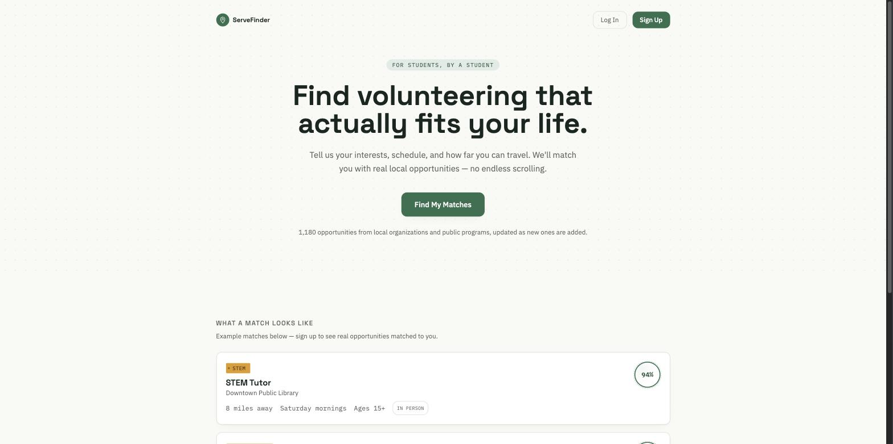
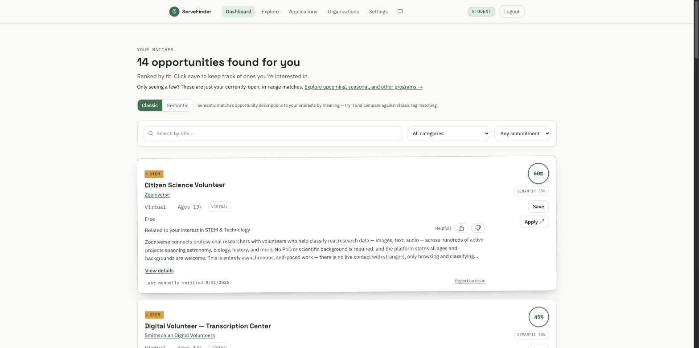
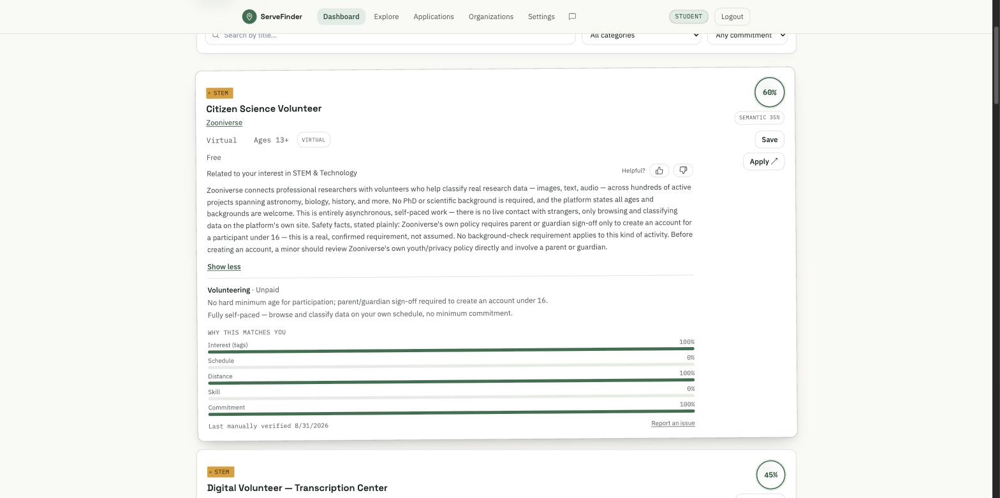
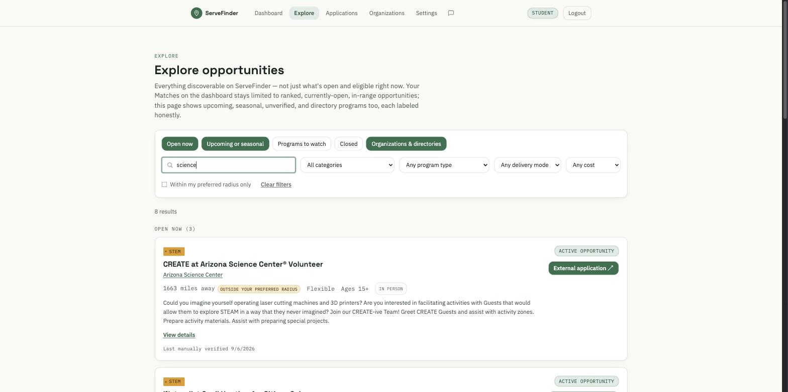
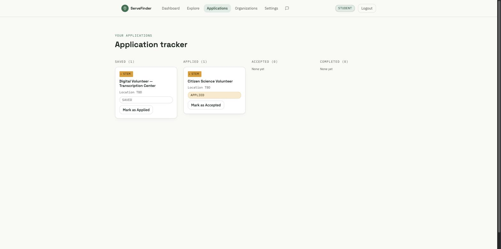
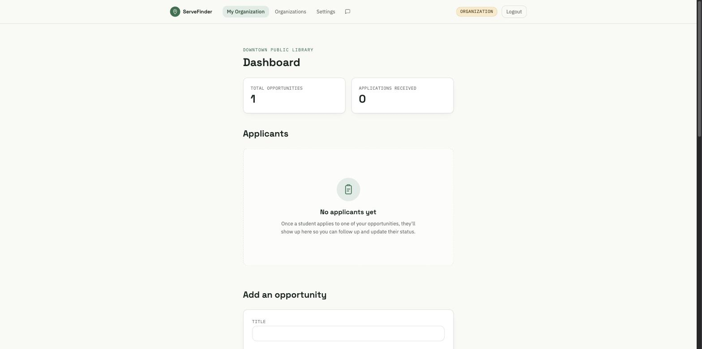

# ServeFinder

[](https://github.com/aaravchoudhary32/servefinder/actions/workflows/test.yml)

**Find volunteering that actually fits your life.**

A full-stack web app that matches high school students to real, age-appropriate volunteer opportunities near them — instead of scattered flyers, word of mouth, or generic listing sites that ignore schedule, distance, and eligibility.

**Live:** [servefinder-app.vercel.app](https://servefinder-app.vercel.app) · **Try it now** with the demo accounts below, no signup required.


*The public landing page. The opportunity count shown is live, pulled from the same database the matching engine reads from.*

---

## The problem

High schoolers looking for volunteer work are stuck choosing between two bad options: scattered paper flyers and word of mouth, or generic national listing sites that dump hundreds of results on you with no regard for whether you're actually old enough, whether it's anywhere near you, or whether it fits around school. Nothing filters for the constraints that actually decide whether a student can say yes.

**ServeFinder is built for two audiences:**
- **Students**, who get opportunities ranked by genuine fit — not just a keyword search — with a hard age-eligibility filter (an opportunity that requires being 16 simply never appears for a 13-year-old, regardless of how well it otherwise scores) and a plain-language explanation of *why* each result matched them.
- **Organizations**, who get a self-service way to post and manage listings, review applicants, and track status — without needing an account manager or a support ticket.

## See it in action

**[Create your own student account](https://servefinder-app.vercel.app/login)** — free, takes under a minute, no email verification required to see your own real matches. Prefer not to sign up? The screenshots throughout this README walk through every major screen — dashboard, search, match details, and the application tracker — so you can see exactly how it works without creating an account.

---

## What it does

### For students


*The student dashboard: ranked matches, a live classic/semantic toggle, and category/commitment filters.*

- **Weighted matching, not keyword search.** Every ranked opportunity is scored as `30% interest fit + 25% schedule fit + 20% distance fit + 15% skill fit + 10% commitment fit` (`lib/matching.ts`). Age eligibility and travel distance are **hard filters** applied before scoring, not soft preferences — a student under an opportunity's minimum age, or one they have no realistic way to reach, never sees it at all, no matter how well it would otherwise score.
- **Semantic matching as an alternative lens.** A second, opt-in matching mode compares an opportunity's actual description to a student's stated interests by *meaning* (via text embeddings) rather than exact tag overlap, so a good conceptual fit surfaces even when the wording doesn't line up with the student's own tags. The dashboard lets a student toggle between classic and semantic side by side.
- **Transparent "why this matches you."** Every match shows its own per-factor breakdown (interest, schedule, distance, skill, commitment) — never just a bare score.

  
  *Every match explains itself: full eligibility details plus a factor-by-factor breakdown of why it scored the way it did.*

- **Explore beyond ranked matches.** A separate, unranked search/browse page surfaces upcoming, seasonal, unverified, and directory-only listings that the ranked dashboard deliberately excludes — labeled honestly as such, with full filtering by category, program type, delivery mode, cost, and search text.

  
  *Full-catalog search — everything discoverable, not just what's currently open and in range.*

- **A real application tracker**, not just a saved-items list: Saved → Applied → Accepted → Completed, one board, self-reported by the student or (for the last two stages) confirmed by the organization.

  
  *The full status lifecycle, tracked in one place.*

- **Matching-quality feedback.** A one-click "Was this match helpful?" on every card feeds a comparison the admin dashboard uses to evaluate whether classic or semantic matching is actually performing better — not just a suggestion box nobody reads.

### For organizations


*An organization's own dashboard: their listings, their applicants, and a form to post more — scoped entirely to their own account.*

- Self-service signup, no admin approval needed to start — though a self-signed-up organization's listings only go public once an admin marks the organization **verified**, so the catalog isn't self-certifying.
- Post, edit, and manage opportunities directly, plus a **bulk CSV import** for organizations with many listings to add at once (with a validation preview before anything is written, and update-by-external-ID on re-upload so re-importing never creates duplicates).
- Review applicants and advance their status to Accepted/Completed — scoped strictly to that organization's own opportunities; the database layer (not just the UI) prevents one organization from ever seeing another's applicants.

### Automated opportunity ingestion

Nine independent connectors (`lib/ingestion/sources/`) automatically fetch, normalize, and deduplicate listings from real public sources — city/county programs, humane societies, food banks, libraries, and more — on a weekly Vercel cron schedule, alongside the org-facing CSV import as a tenth, UI-triggered "source" that reuses the same pipeline. Every source shares one normalization and fingerprint-based deduplication layer, so the same real-world listing re-fetched next week updates the existing row instead of creating a duplicate. Two sources need a real headless browser (one for a WAF that blocks non-browser clients, one historically for a JS-only page since rewritten to call the portal's own API instead) — everything else is a direct HTTP fetch.

### Privacy-conscious product analytics

An admin-only analytics dashboard (`/admin/user-analytics`) tracks genuine adoption and engagement — registrations, DAU/WAU/MAU, an onboarding-to-completion funnel, 30-day trends — from a purpose-built event log (`analytics_events`) with real constraints, not an afterthought:
- **A server-side allowlist, not just a client-side convention.** Event metadata is restricted to a fixed set of short, structured fields (match mode, a status transition, a broad category, a boolean) — enforced as a Postgres check constraint, not only in the TypeScript layer, so a client that bypassed the app's own code couldn't smuggle free text, location, or an email through it either.
- **Admin-controlled test/demo exclusion**, not a runtime guess: a dedicated table lets an admin explicitly mark automated-test, manually-tested, or demo accounts as excluded from every adoption number — accounts are never deleted to achieve this, only left out of the totals — while anything merely *resembling* a test account is surfaced for a human to decide, never auto-excluded (a false positive there would silently undercount real adoption).
- **No individual browsing history is ever shown**, even to an admin — every number on the dashboard is an aggregate.

### Security and role-based access

Every protected page does a client-side role check purely as a UX convenience (so a student doesn't land on a page meaningless for their account) — **the real authorization boundary is Postgres Row Level Security**, enforced against the caller's own database session regardless of which page requested the data or whether its client-side check was bypassed. Four distinct roles (anonymous, student, organization, admin) each get exactly the read/write access their RLS policies grant, never more; a handful of narrowly-scoped security-definer functions handle the few actions that legitimately need to cross that boundary (creating an organization account, advancing an applicant's status). The full role matrix, policy reasoning, and known residual risks are documented in [`SECURITY.md`](SECURITY.md) — including what's *not* covered, stated plainly rather than glossed over.

### Admin tools

A review queue and catalog dashboard for managing opportunities/organizations, an ingestion health log (per-source last-success timestamps, surfaced as a failure banner when something's been silently broken), a structured in-house error log, and the user-analytics dashboard above — all admin-only, all reachable from one `/admin` hub.

### Accessibility, testing, and CI

- Automated `axe-core` accessibility scans across every major page (login, onboarding, dashboard, Explore, organizations, admin, org-dashboard) with **zero serious/critical violations**, plus manual patterns like a first-tab-stop skip link and screen-reader announcements for loading/error states.
- A real Playwright browser suite drives the two critical end-to-end journeys — student signup → onboarding → view/save/apply, and organization signup → onboarding → post an opportunity → review and accept an applicant — through the actual UI against a real database, not mocks.
- Unit tests (Vitest) cover the matching algorithm and the ingestion normalize/dedup logic with no database required; separate integration tests exercise RLS and cross-organization isolation against the real, live database. Unit tests run on every push via GitHub Actions; integration/accessibility/e2e tests need a live server and database, so they're run by hand before anything RLS- or auth-related ships.
- Fully responsive: a mobile nav, touch-target-sized controls throughout, and a mobile-specific pass in the accessibility suite.

---

## Metrics — read this before quoting a number

As of this writing: **1,180 opportunities are approved and publicly visible** to students; the underlying database holds **1,253 total opportunity records** (the gap is pending-review, rejected, and merged-duplicate rows, which exist but are never shown publicly) across **355 organizations**. These are catalog-size numbers, not usage numbers — this project has not yet run a real pilot with students, so there is no adoption or "active user" figure to report, and none is claimed here.

## Architecture

```
Next.js (App Router) ── Client Components ── Supabase client SDK
                                                      │
                                          Postgres (Supabase) + RLS
                                                      │
                              Vercel Cron ── ingestion connectors ── external sources
```

- **No `middleware.ts`, deliberately.** Every protected page is a Client Component; Row Level Security is the actual security boundary, not the page-level check. See [`SECURITY.md`](SECURITY.md) and [`ARCHITECTURE.md`](ARCHITECTURE.md) §5 for the full reasoning.
- **No separate backend service.** Next.js API routes handle the handful of actions that need a service-role credential (account deletion, resolving an applicant's email, the ingestion cron endpoints); everything else talks to Supabase directly from the client, scoped by RLS.
- `ARCHITECTURE.md` (2,000+ lines) is the living design record of *why*, not just *what* — decisions, dead ends, and the reasoning behind them, kept current as the app changes.

**Tech stack:** Next.js + React + TypeScript, Tailwind CSS · Supabase (Postgres, Auth, Row Level Security) · Vercel (hosting + cron) · Vitest (unit/integration) + Playwright (accessibility/e2e) · text embeddings for semantic matching, computed and stored in Postgres — no separate vector database.

---

## Local setup

```bash
git clone https://github.com/aaravchoudhary32/servefinder.git
cd servefinder
npm install
cp .env.local.example .env.local   # fill in your OWN Supabase project's values — see below
npm run dev
```

`.env.local.example` contains placeholders only — `your-supabase-project-url`, `your-supabase-anon-key`, and so on. **There is no shared or production Supabase project you can point this at**; running this app requires creating your own free Supabase project and filling in *its* URL and keys. Nothing in this repository can accidentally connect a contributor's local setup to the live production database.

Then, in your own Supabase project's SQL editor: run `supabase/schema.sql` to create every table and RLS policy, then `supabase/seed.sql` for sample opportunities to develop against. If you want the same documented demo accounts locally, run `npm run seed:demo-accounts` afterward (needs your project's service-role key in `.env.local`).

Full setup detail — admin access, the ingestion fetcher scripts, the `special-olympics-az`/`city-of-phoenix` headless-browser caveats, bulk CSV import, self-service account deletion — lives in this README's companion docs (`ARCHITECTURE.md`, `SECURITY.md`, `RUNBOOK.md`) rather than duplicated here.

## Testing

```bash
npm test                 # unit tests (Vitest) — no database needed
npm run test:coverage    # same, with a coverage report
npm run test:integration # RLS/authorization tests — needs your own service-role key
npm run test:a11y        # accessibility (Playwright + axe) — needs `npm run dev` running
npm run test:e2e         # end-to-end critical-journey tests — same requirement
npm run lint             # ESLint
npx tsc --noEmit         # TypeScript
npm run build            # production build
```

Unit tests run automatically on every push via GitHub Actions. Integration, accessibility, and e2e tests need a live server and a live database, so they're run by hand rather than in CI — see [`SECURITY.md`](SECURITY.md) for why, and for the full verification checklist run before any RLS- or auth-related change ships.

## Privacy and security design

Full detail lives in [`SECURITY.md`](SECURITY.md) (architecture, role matrix, RLS guarantees, rate limiting, known residual risks) and [`RUNBOOK.md`](RUNBOOK.md) (backups, rollback, incident response) — written as an honest account of what exists and what's still missing, not a compliance claim. Highlights: RLS as the real authorization boundary regardless of page-level checks; a server-side-enforced allowlist on every analytics event's metadata; self-service account deletion and full data export from `/settings`; and an explicit, documented list of what this project does *not* yet have (no automated backups on the current Supabase plan, no distributed rate limiting, no third-party security audit).

---

## Project status and limitations

🚧 **Pre-launch.** The core product — matching, both account types' full workflows, admin tools, automated ingestion, analytics, accessibility, and test coverage — is built and deployed, but this has not yet been piloted with real students. Known limitations, stated plainly:

- No email notifications yet (new applications, status changes) — scoped and deferred until there are real users to justify the integration.
- No public API.
- The in-process rate limiter doesn't coordinate across concurrent serverless instances — a real, accepted limitation at current scale, not a broken feature.
- No formal accessibility or security audit by a third party — the accessibility suite is automated (axe-core) and the security posture is self-documented, not independently verified.
- No legal review of the privacy policy or terms of service — treat that copy as descriptive, not as an established compliance claim.

## Roadmap

- [x] Matching algorithm (weighted + semantic), with full transparency into why a match scored the way it did
- [x] Student workflow: onboarding, dashboard, Explore/search, save/apply tracking, matching-quality feedback
- [x] Organization workflow: self-service accounts, listing management, bulk CSV import, applicant review
- [x] Automated multi-source ingestion with shared normalization, deduplication, and health logging
- [x] Role-based security via Postgres RLS, documented and tested
- [x] Admin tools: review queue, catalog dashboard, ingestion log, error log, privacy-conscious user analytics
- [x] Accessibility (automated axe-core coverage) and a real Playwright e2e suite for both critical journeys
- [x] Deployed to production — live at https://servefinder-app.vercel.app
- [ ] Pilot with real students
- [ ] Email notifications
- [ ] Public API

---

## A note on how this was built

This project was built with heavy use of AI-assisted development (Claude Code) alongside direct engineering decisions and review at every step — architecture choices, security tradeoffs, what to build and what to explicitly defer, and verifying behavior against the real, live app rather than assuming it. The commit history and `ARCHITECTURE.md`'s decision log reflect how it actually evolved, including a mid-project rebrand and the real incidents (a disconnected Vercel Git integration, a since-fixed analytics bug found via live production testing) that shaped some of the current safeguards. Nothing here claims a "100% hand-written, line by line" origin — the interesting engineering is in the decisions, the tradeoffs, and the verification, not in typing speed.
